# Bus Gallery 重构结构化需求文档（最新版）

## 0. 文档目标与范围
本文档用于把当前仓库交接给“其他 AI 或新团队”做重构实现。文档基于当前目录真实代码整理，覆盖前端、后端（`backend`）、业务中间层（`bridge`）、交易域后端（`group`）、统一网关（`gateway`）、容器化部署（`docker`）与中间件（MySQL/Redis/MinIO/RabbitMQ/Nginx/Nacos）。

本文档约束重构目标不是“功能演示版”，而是“可部署、可鉴权、可追踪、可压测”的工程化版本。

### 0.1 最新代码同步（2026-03-30）
- `GroupBuyMarket.vue` 已按当前代码更新为“正在拼团 + 我的拼团进度”融合展示，避免上下文丢失时空列表。
- “我的拼团进度”中，`trade_status=0` 的记录不再触发重复支付；主动作改为查看队伍/商品详情，`trade_status=2` 才允许重新拼团。
- `group` 服务 `TradePortalService.groupCheckout` 增加硬性防重：同一用户在同一 `goodsId + activityId` 存在进行中队列时，拒绝重复下单（`A0409` 冲突）。
- 前端下单入口增加同规则前置拦截：若当前商品拼团队列已包含自己，按钮禁用并提示“不能重复下单”。

## 1. 系统全景（组件、调用、配置）

### 1.1 组件职责总览
- `frontend`：Vue3 前端，负责页面渲染、路由守卫、token 注入、交易入口 UI。
- `gateway`：统一 API 入口，负责路由、会话校验、内部身份头注入、错误码统一。
- `backend`：内容域核心服务，负责用户、车辆、图片、上传、审核、评论收藏、交易桥接（内容侧）。
- `bridge`：业务中间层，负责把交易相关接口收口到 `/api/bridge/**`，并编排 content/group 调用。
- `group`：交易域服务（六层架构），负责商品活动、锁单、结算、拼团、超时退款、交易记录与消息。
- `docker + nginx`：部署编排与外层限流，Nginx 把 `/api/**` 全量转发到 gateway。
- `nacos`：服务注册与发现中心，gateway 路由与 bridge Feign 均通过注册中心发现后端实例。
- 中间件：MySQL（`bus_gallery` + `trade_center`）、Redis、MinIO、RabbitMQ、Nacos。

### 1.2 组件调用关系（总图）
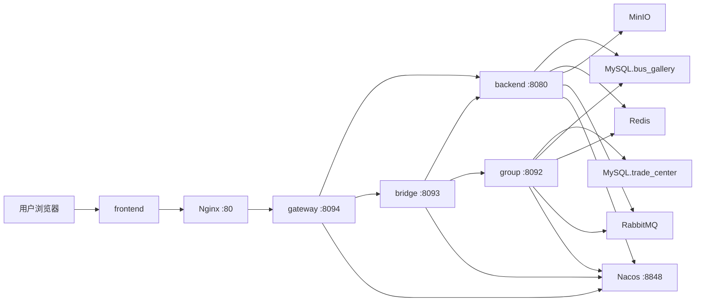

### 1.3 关键端口与容器（docker-compose）
- 前端：`80:80`
- MySQL：`13306:3306`
- Redis：`6379:6379`
- MinIO 控制台：`9001:9001`
- RabbitMQ：`5672`、`15672`
- backend：容器内 `8080`
- bridge：容器内 `8093`
- group：容器内 `8092`
- gateway：容器内 `8094`
- Nacos：`8848:8848`

### 1.4 外层网关与限流配置（Nginx）
当前 `docker/nginx/default.conf` 的关键限制：
- `client_max_body_size 50M`
- `/api/upload`：`upload_ip 6r/s`，`upload_global 40r/s`
- `/api/auth/`：`auth_ip 12r/s`，`auth_global 120r/s`
- `/api/images/access/`：`image_access_ip 80r/s`，`image_access_global 800r/s`
- 其他 `/api/*`：`api_ip 25r/s`，`api_global 180r/s`
- 所有 `/api/**` 均 `proxy_pass http://gateway:8094`

### 1.5 内部鉴权签名一致性约束（必须）
- Gateway 读取 `busgallery:sessions:{token}`，注入 `X-User-Id/X-Role/X-Auth-Ts/X-Auth-Signature`。
- backend/bridge/group 均验证 HMAC 签名。
- 三个后端与 gateway 必须使用同一 `GATEWAY_INTERNAL_AUTH_SECRET`，否则会出现 `Gateway auth signature mismatch`（401）。

---

## 功能 1：统一入口与路由收口（Nginx + Gateway）

### 功能概述
该功能把所有外部请求统一收口，避免前端直连多个后端。Nginx 只做静态资源与限流转发；Gateway 做真实 API 路由与入口鉴权；`group` 原生接口外部封堵，只允许桥接路径访问。

### 业务流程（完整链路）
1. 浏览器发起页面请求，静态资源由 Nginx 直接返回，业务请求统一走 `/api/**`。
2. 请求到达 Nginx 后先命中对应 location（`/api/upload`、`/api/auth/`、`/api/images/access/`、`/api/`），执行不同的限流窗口与 `burst` 策略。
3. 未被限流拦截的请求由 Nginx 反向代理到 `gateway:8094`，并附带 `X-Real-IP/X-Forwarded-For` 等转发头。
4. Gateway 首先执行全局过滤器与异常处理器，统一做请求预处理与错误码规范化。
5. Gateway 根据路由规则匹配目标服务：`/api/bridge/** -> lb://bus-gallery-bridge`，`/api/auth/** -> lb://bus-gallery`，其余 `/api/** -> lb://bus-gallery`。
6. `lb://` 路由目标由 Nacos 提供实例列表，Gateway 通过服务发现完成负载转发，而不是写死容器地址。
7. 对 `/api/v1/group/**` 的外部访问，Gateway 命中 `block-group-direct` 路由直接返回 404，强制走 bridge 编排链路。
8. 下游服务返回后，Gateway 统一透传响应体并保持错误结构 `{code,message,data}`，Nginx 再将结果返回浏览器。
9. 前端只感知统一入口，不感知后端微服务拆分细节，实现“内部分层可演进、外部协议稳定”。

### 接口清单（API 规范）
| 路径 | 方法 | 下游 | 鉴权 | 说明 |
|---|---|---|---|---|
| `/api/auth/**` | * | backend | 匿名可访问 | 登录注册找回密码 |
| `/api/bridge/**` | * | `lb://bus-gallery-bridge` | 需登录 | 交易桥接入口 |
| `/api/**` | * | `lb://bus-gallery` | 按后端注解 | 内容域接口 |
| `/api/v1/group/**` | * | no://op | 禁止外部 | Gateway 直接 404 |

### 数据结构（字段）
- 路由配置字段：`id`、`uri`、`predicates(Path)`。
- Nginx 限流字段：`limit_req_zone`、`rate`、`burst`、`limit_req_status`。
- Gateway 错误返回：`{ code, message, data }`。

### 界面 / 交互说明
前端不会感知 backend/bridge/group 的真实地址；页面只依赖统一 `VITE_API_BASE_URL`。这意味着后端重构后可替换内部服务地址，不影响前端调用契约。

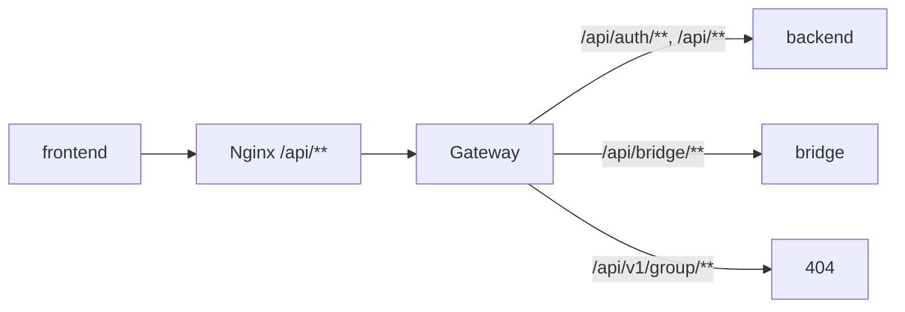

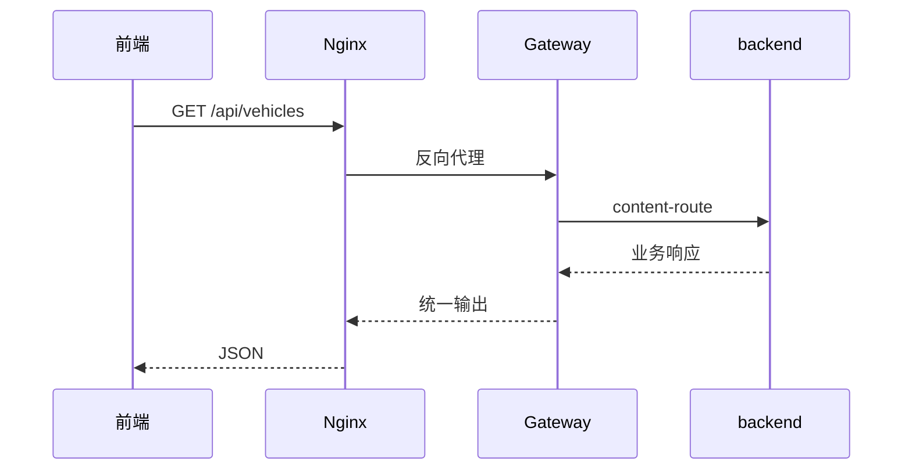

---

## 功能 2：统一会话鉴权与内部身份下传（Gateway + AuthPrincipal）

### 功能概述
该功能负责统一认证可信边界。Gateway 基于 Redis 会话校验外部 token，并下发内部签名身份头；backend/bridge/group 只信任签名后的内部头，并在请求上下文中使用 `AuthPrincipal`，不直接传播完整会话对象。

### 业务流程（完整链路）
1. 用户登录时调用 `/api/auth/login`，backend 校验凭据后在 Redis 写入 `busgallery:sessions:{token}`，并将 token 返回前端。
2. 前端后续请求通过 axios 拦截器自动附加 `Authorization: Bearer <token>`。
3. Gateway 接收请求后解析 token，同时生成或透传 `X-Request-Id` 作为链路追踪标识。
4. Gateway 使用 token 读取 Redis 会话；若会话不存在，则根据路径策略判定：鉴权必需路径返回 401，匿名路径允许继续。
5. 会话存在时，Gateway 读取 `userId/role/reviewRegionId` 等字段，按统一规则生成 HMAC 签名并注入内部身份头。
6. backend/bridge/group 拦截器收到请求后验证 `X-Internal-Auth + X-Auth-Signature + X-Auth-Ts`，防止伪造内网身份。
7. 验签通过后构建 `AuthPrincipal` 放入 `ThreadLocal`，控制器通过 `@RequireLogin` 与角色判断进行访问控制。
8. 任一环节失败统一返回标准错误码（如 `A0401`），前端收到 401 后重置登录态并跳转登录页。
9. 三个下游服务必须共享同一网关签名密钥，否则会触发 `Gateway auth signature mismatch`。

### 接口清单（API 规范）
| 接口 | 方法 | 认证 | 说明 |
|---|---|---|---|
| `/api/auth/login` | POST | 否 | 登录并创建 Redis 会话 |
| `/api/auth/logout` | POST | 是 | 会话失效 |
| `/api/users/me` | GET | 是 | 当前用户信息 |
| 其他标注 `@RequireLogin` 接口 | * | 是 | 基于 `AuthPrincipal` 控制 |

### 数据结构（字段）
- Redis session key：`busgallery:sessions:{token}`
- session payload 核心字段：`userId`、`username`、`displayName`、`role`、`reviewRegionId`
- 内部头：
  - `X-Internal-Auth`
  - `X-User-Id`
  - `X-Username`
  - `X-Display-Name`
  - `X-Role`
  - `X-Review-Region`
  - `X-Auth-Ts`
  - `X-Auth-Signature`
- 上下文对象：`AuthPrincipal(userId, username, displayName, role, reviewRegionId, token)`

### 界面 / 交互说明
前端层面是“登录态自动续用 + 401 自动跳转登录页”。`axiosInstance` 已内置 token 注入、401 处理、短暂抖动重试（GET 超时重试、429 重试）。用户视角是“失效即回登录，登录后自动回跳原页面”。

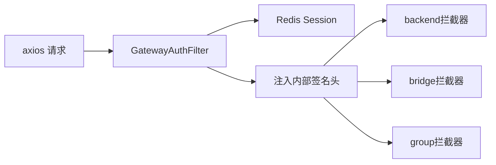

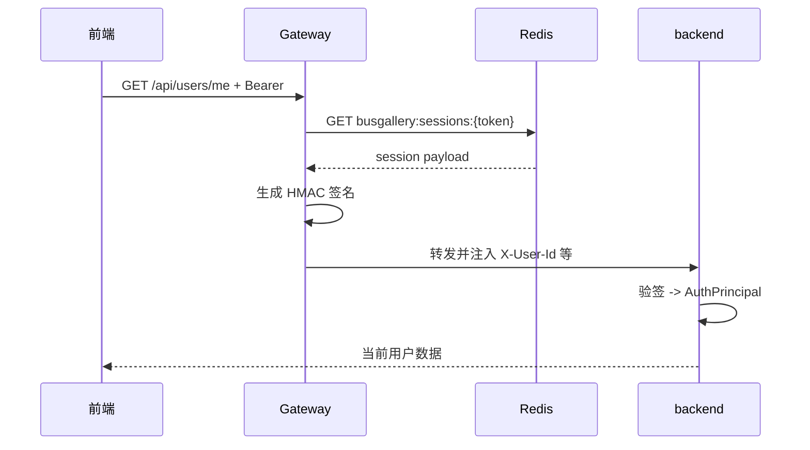

---

## 功能 3：内容上传、分片、幂等与图像三版本处理

### 功能概述
该功能处理上传主链路：支持普通上传与分片上传；上传阶段生成 `original + display + thumbnail` 三版本；结合 `Idempotency-Key` 防重复提交；普通用户进入审核流，站长可直接落正式数据并触发交易绑定。

### 业务流程（完整链路）
1. 上传入口分两条：小文件走 `/api/upload`，大文件走 `/api/upload/chunk/init -> part -> complete`。
2. 分片模式下，后端先初始化上传会话并记录分片元信息；前端按 index 顺序/重试上传分片，可通过 `/progress` 查询进度。
3. `complete` 阶段后端校验分片完整性并合并文件，随后进入统一上传处理流程。
4. 后端执行上传安全校验：文件大小、MIME、分辨率、像素上限、用户频率、全局频率、每日额度、待审上限等。
5. 若请求携带 `Idempotency-Key`，后端先做幂等判重，避免弱网重复提交导致重复写库。
6. 图像处理阶段生成三类对象：`original`（原图）、`display`（受控高清+水印+压缩）、`thumbnail`（缩略图）。
7. 处理结果写入 MinIO 后，事务性写入 `image`、`vehicle`、`vehicle_image`、`vehicle_config` 等关系数据。
8. 对普通用户，写入 `vehicle_submission(PENDING)` 进入审核流；对站长或有权限角色可直接入正式数据。
9. 上传成功后返回车辆与图片摘要，前端刷新列表时优先消费缩略图和受控高清图，不直接暴露原图对象地址。

### 接口清单（API 规范）
| API | 方法 | 认证 | 关键入参 |
|---|---|---|---|
| `/api/upload` | POST multipart | 是 | `file`、`payload`、`Idempotency-Key` |
| `/api/upload/chunk/init` | POST | 是 | `fileName/contentType/totalSize/chunkSize/totalChunks` |
| `/api/upload/chunk/{uploadId}/part` | POST multipart | 是 | `index` + `file` |
| `/api/upload/chunk/{uploadId}/progress` | GET | 是 | `uploadId` |
| `/api/upload/chunk/{uploadId}/complete` | POST | 是 | `payload`、可选幂等键 |
| `/api/upload/chunk/{uploadId}` | DELETE | 是 | 取消分片 |

### 数据结构（字段）
- `image`：`id/object_name/url/thumbnail_url/hash/uploader_id/content_type/width/height`
- `vehicle`：`id/model_id/company_id/region_id/plate_number/custom_number/launch_date/view_count`
- `vehicle_image`：`vehicle_id/image_id/is_cover/sort_order`
- `vehicle_submission`：`action_type/status/submitter_id/reviewer_id/request_payload/reject_reason`
- 关键配置：
  - `busgallery.upload-security.*`
  - `busgallery.image-access.upload-watermark-*`
  - `busgallery.image-access.upload-jpeg-quality`
  - `busgallery.image-access.upload-max-side`

### 界面 / 交互说明
上传页需要支持“中断恢复、重复提交保护、可感知进度”。当前前端在上传接口设置更长 timeout，并在弱网场景尽量避免重复提交。用户操作感受是：上传失败可重试，成功后可看到审核状态而不是静默失败。

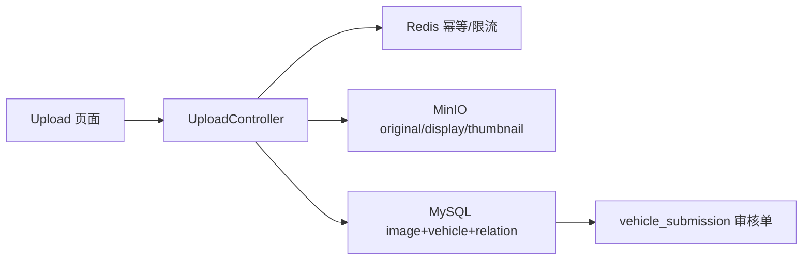

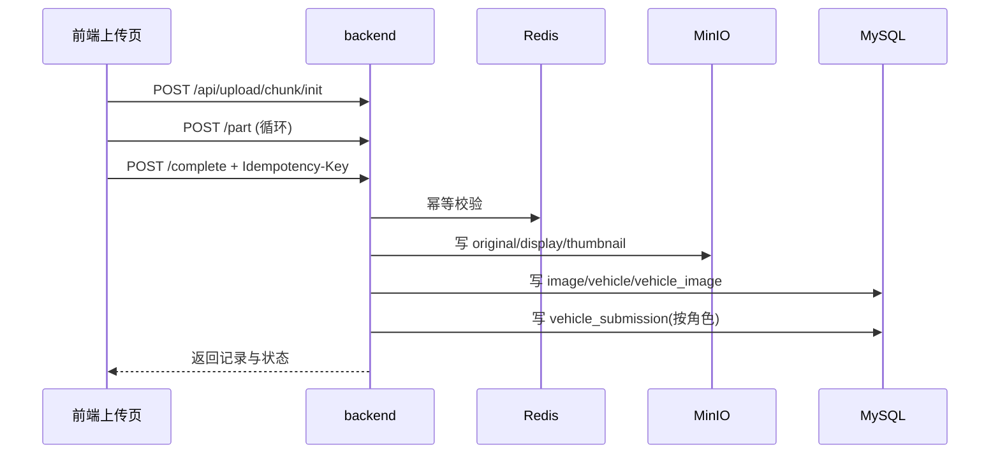

---

## 功能 4：图片检索与展示（首页/图库/公司/车型，懒加载与分页）

### 功能概述
该功能负责内容消费链路。首页使用按变体逐条瀑布加载；图库页采用每页 12 条分页并持久化 `?page=`；公司详情和车型详情采用“先汇总、后按需车辆明细”的懒查询，降低全量读取压力。

### 业务流程（完整链路）
1. 首页进入后优先请求 `/api/vehicles`，按游标（`lastLaunch/lastId`）滚动加载；图库页按固定页大小（12 条）走分页并将页码写入 query。
2. 后端接收筛选参数（地区/公司/品牌/车型/关键词）后执行 SQL 查询，并结合 Redis 页缓存降低热点重复查询压力。
3. 列表接口返回 `records + total + nextLaunch + nextId`，前端据此更新卡片与分页/滚动状态。
4. 首页卡片仅渲染列表已有字段，不再触发卡片级“再查一次全量变体”的额外请求，避免放大读压。
5. 用户点击卡片时才请求 `/api/vehicles/{id}` 或同车牌详情，详情弹窗进行按需加载，不阻塞列表滚动。
6. 公司页与车型页首屏先加载汇总接口（`model-summaries/company-summaries`），不默认拉取全部车辆明细。
7. 用户点击“查看某公司/某车型明细”后，再触发明细查询，且按页（或游标）懒加载，避免一次性全查。
8. 前端对同一资源在短时间内做去重/缓存，减少重复请求；网络抖动时用短重试提升可用性。
9. 页面刷新时通过路由参数恢复筛选和页码，保证可分享、可回退、可复现的浏览状态。

### 接口清单（API 规范）
| API | 方法 | 认证 | 用途 |
|---|---|---|---|
| `/api/vehicles` | GET | 否 | 首页/图库列表（支持 cursor） |
| `/api/vehicles/{id}` | GET | 否 | 车辆详情 |
| `/api/vehicles/plate/{plateNumber}` | GET | 否 | 同车牌变体 |
| `/api/vehicles/sample` | GET | 否 | 公司+车型样本图 |
| `/api/companies/{id}/model-summaries` | GET | 否 | 公司下车型汇总 |
| `/api/models/{id}/company-summaries` | GET | 否 | 车型下公司汇总 |
| `/api/companies/{id}/vehicles` | GET | 否 | 公司车辆明细 |
| `/api/models/{id}/vehicles` | GET | 否 | 车型车辆明细 |

### 数据结构（字段）
- 列表项结构：`vehicle` + `images[]` + `vehicleConfig`
- 分页/游标字段：`total/page/size/nextLaunch/nextId`
- 车型汇总：`modelId/modelName/count/thumbnailUrl`
- 公司汇总：`companyId/companyName/count/thumbnailUrl`

### 界面 / 交互说明
首页强调“热门图片流式浏览”，图库强调“分页可控与回跳不丢页”，公司/车型页强调“默认轻查询，按需拉明细”。这三类页面共同目标是减少默认全量扫描，保证大数据量下前台可用性。

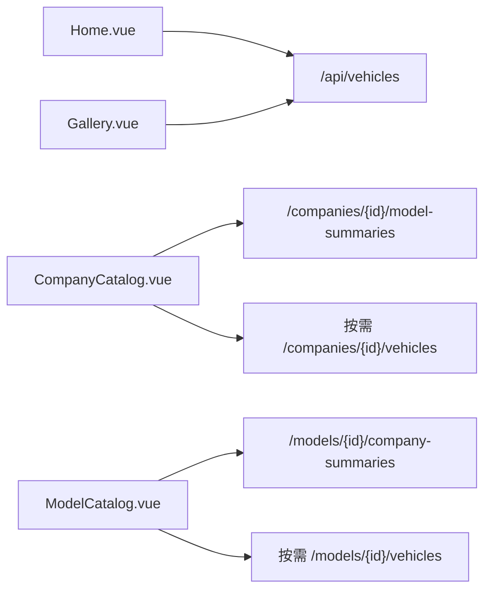

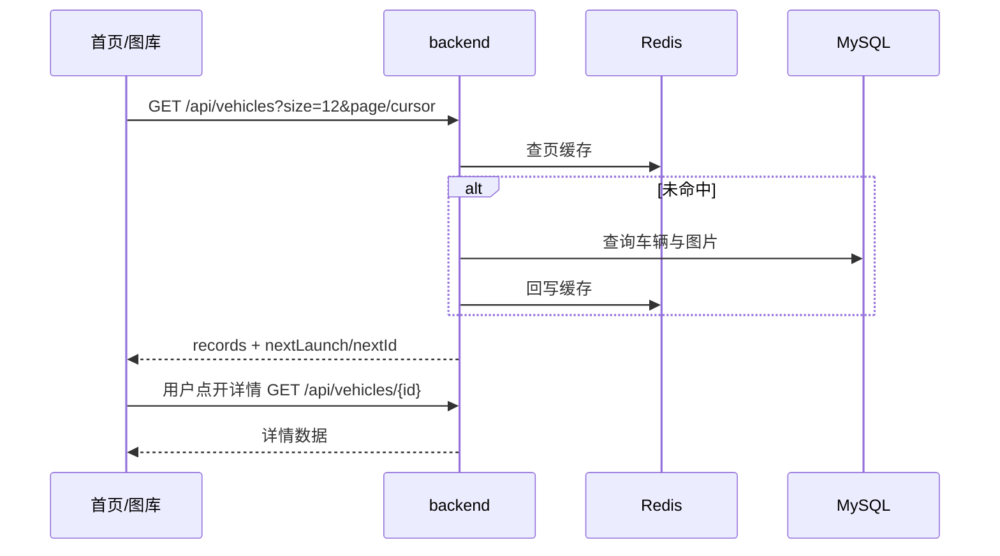

---

## 功能 5：图片访问控制与下载策略（缩略图/受控高清/原图）

### 功能概述
该功能把“可看图”与“可拿原图”分离。普通页面使用缩略图，详情/审核页使用受控高清图，原图不对公开页面直接暴露；原图下载必须经过交易权限校验。

### 业务流程（完整链路）
1. 后端在返回图片数据时，不直接返回 MinIO 公网对象地址，而是返回受控签名访问地址（基于 token + 过期时间 + HMAC）。
2. 前端在列表页优先使用 `thumbnailUrl`，在详情/审核场景使用 `display` 图，不直接展示原图链接。
3. 浏览器请求 `/api/images/access/{token}` 时，后端先验 token 签名与过期时间，再解析对应对象名。
4. 验证通过后，后端从 MinIO 拉取对象流并回传；验证失败返回 401/404，阻断越权或过期访问。
5. 因 token 有 TTL，历史链接会自然失效，需要重新通过业务接口获取新签名地址。
6. 原图下载严格走交易链路：前端访问 `/api/bridge/purchases/{recordId}/download`。
7. bridge 转发到 backend 的 `trade-bridge` 下载接口，backend 校验 `recordId + app_user_id + can_download`。
8. 校验通过后才会签发原图流并以附件形式返回；未购买、未成团、非本人访问均被拒绝。
9. 该策略确保“页面可浏览”和“原图可下载”是两套权限，不会因前端 F12 直接拿到原图对象地址。

### 接口清单（API 规范）
| API | 方法 | 认证 | 说明 |
|---|---|---|---|
| `/api/images/access/{token}` | GET | token 校验 | 受控图片回源 |
| `/api/images/vehicle/{vehicleId}` | GET | 否 | 车辆图片列表 |
| `/api/trade-bridge/purchases/{recordId}/download` | GET | 是 | 内容域下载校验（后端） |
| `/api/bridge/purchases/{recordId}/download` | GET | 是 | 对前端暴露的统一下载入口 |

### 数据结构（字段）
- 签名配置：`token-secret`、`full-ttl-seconds`、`thumbnail-ttl-seconds`
- 图片版本字段：`url`（display）、`thumbnailUrl`（thumbnail）、`objectName`（original）
- 交易下载校验字段：`trade_user_record.record_id/app_user_id/can_download/image_id`

### 界面 / 交互说明
用户在列表页看到的是轻量图；进入详情页看到受控高清；完成购买后自动跳转下载页，浏览器触发附件下载。前端不会直接存储原图地址，下载链接由后端实时签发与校验。

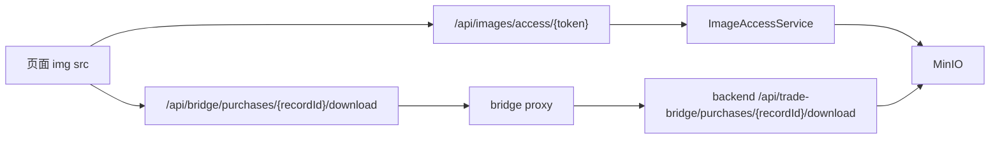

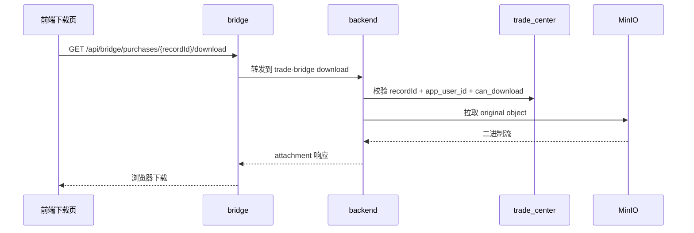

---

## 功能 6：审核与后台治理（审核员/站长）

### 功能概述
该功能负责内容治理闭环。普通用户的上传变更进入待审核；审核员按区域处理；站长全局治理用户权限、字典表、评论与异常图片，支持批量删除，适配压测前后清理场景。

### 业务流程（完整链路）
1. 普通用户提交上传/编辑后，系统先落 `vehicle_submission`，状态为 `PENDING`，并记录请求快照。
2. 审核员进入审核中心读取 `inbox/pending`，按区域权限只看到可处理的待审数据。
3. 审核员查看车辆基础信息、图片、配置与历史上下文，执行“通过”或“驳回”决策。
4. 通过时，后端将快照写入正式业务表（车辆、图片、配置、关联）；驳回时写入拒绝原因与审核人信息。
5. 审核动作会更新 submission 状态与审计字段（reviewer/reviewedAt/reviewPayload），保证可追溯。
6. 站长可跨区域查看全局数据，执行用户角色调整、字典维护、评论治理、异常图片清理等管理动作。
7. 对压测或批量脏数据场景，站长可使用批量删除接口快速清理车辆、评论、字典项，防止后台持续高负载。
8. 前端路由层对 REVIEWER/STATION 做权限保护，未授权用户无法进入审核与后台页面。

### 接口清单（API 规范）
| API | 方法 | 认证 | 说明 |
|---|---|---|---|
| `/api/reviews/inbox` | GET | REVIEWER/STATION | 审核收件箱 |
| `/api/reviews/pending` | GET | REVIEWER/STATION | 待审列表 |
| `/api/reviews/{id}/approve` | POST | REVIEWER/STATION | 通过 |
| `/api/reviews/{id}/reject` | POST | REVIEWER/STATION | 拒绝 |
| `/api/admin/overview` | GET | STATION | 后台总览 |
| `/api/admin/tables/*` | GET/POST/PUT/DELETE | STATION | 字典维护 |
| `/api/admin/*/batch-delete` | POST | STATION | 批量删除 |
| `/api/admin/comments*` | GET/DELETE/POST | STATION | 评论治理 |
| `/api/admin/images/suspects*` | GET/POST | STATION | 异常图片治理 |

### 数据结构（字段）
- `vehicle_submission`：`status/action_type/request_payload/review_payload/reviewer_id/reject_reason`
- `app_user.role`：`USER/REVIEWER/STATION`
- 字典表：`region/company/brand/model`
- 后台批量删除入参：`{ ids: number[] }`

### 界面 / 交互说明
审核中心强调“待办流转”，后台强调“治理效率”。前端已提供站长集中后台页和审核中心页，角色不足时路由守卫阻断。对于大量压测数据，批量删除入口能显著降低人工清理成本。

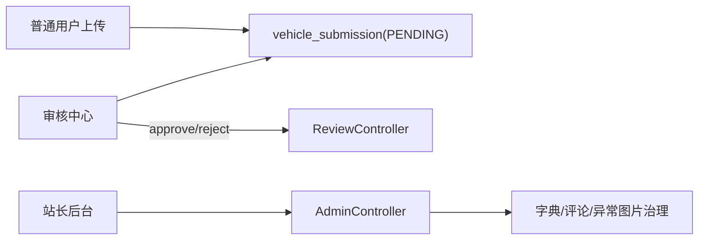

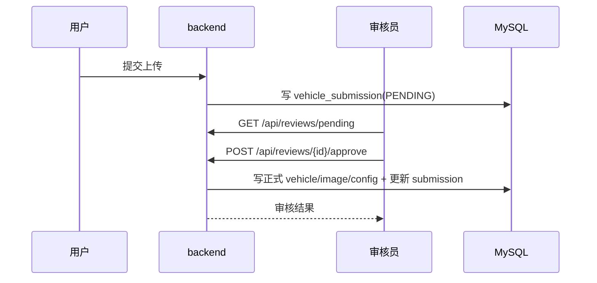

---

## 功能 7：互动系统（评论聚合、点赞幂等、收藏列表）

### 功能概述
该功能实现用户互动。评论绑定车牌号（跨变体共享）；点赞采用幂等 set 语义（`liked=true/false`），弱网重复请求不会把计数打乱；收藏支持分页查询。

### 业务流程（完整链路）
1. 用户打开车辆详情时，前端并行请求评论分页与点赞摘要，首屏展示最新互动状态。
2. 评论新增时，后端校验登录态与内容合法性后写入 `vehicle_comment`，并同时绑定规范化 `plate_number`。
3. 因评论按车牌聚合，同车牌不同变体可共享评论，切换变体时不会丢失讨论上下文。
4. 评论删除支持本人删除与站长治理删除，删除后立即失效相关缓存并更新前端列表。
5. 点赞接口采用 `PUT /favorites/{vehicleId}` + `{liked:true/false}` 状态写入语义，不采用增减命令。
6. 后端通过唯一约束与幂等逻辑保证重复请求最终一致，弱网重放不会产生重复点赞记录。
7. 点赞摘要（总数、当前用户状态、展示头像）从缓存读取，写操作后做定向失效或刷新。
8. 互动主链路先确保 MySQL 成功，再异步触发通知/推荐/热度类副任务，副任务失败不回滚主链路。
9. 前端在网络抖动时可重试 GET，请求恢复后界面状态以服务端最终结果为准。

### 接口清单（API 规范）
| API | 方法 | 认证 | 说明 |
|---|---|---|---|
| `/api/vehicles/{vehicleId}/comments` | GET | 否 | 评论分页 |
| `/api/vehicles/{vehicleId}/comments` | POST | 是 | 新增评论 |
| `/api/vehicles/{vehicleId}/comments/{commentId}` | DELETE | 是 | 删除评论 |
| `/api/favorites/{vehicleId}` | PUT | 是 | 幂等点赞切换 `{liked}` |
| `/api/favorites/{vehicleId}/summary` | GET | 否 | 点赞摘要 |
| `/api/favorites` | GET | 可选登录 | 收藏分页 |

### 数据结构（字段）
- `vehicle_comment`：`vehicle_id/plate_number/user_id/content/created_at`
- `vehicle_favorite`：`vehicle_id/user_id/created_at`（唯一约束防重复）
- 点赞摘要：`liked/total/topUsers`
- 评论分页：`records/page/size/total`

### 界面 / 交互说明
详情弹窗内评论区支持发布、删除与刷新；点赞按钮用状态式交互（已点赞/未点赞），不是命令式增减。该设计对移动弱网更稳健，用户重复点击最终会落到同一状态。

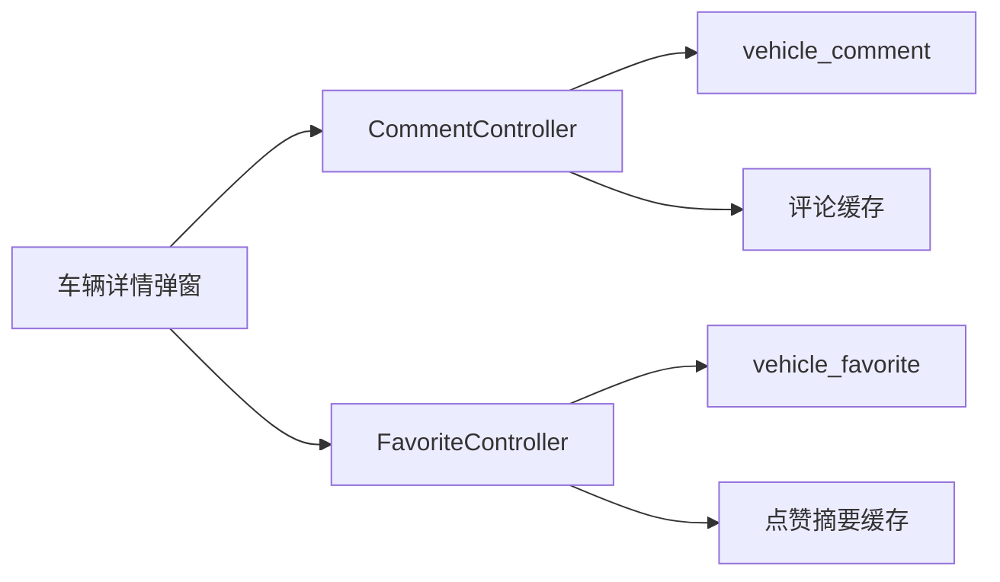

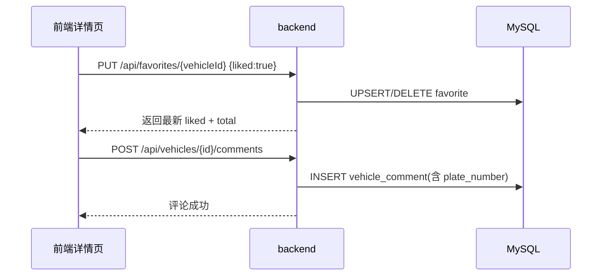

---

## 功能 8：交易桥接层（bridge + backend trade-bridge）

### 功能概述
该功能把内容平台与交易域解耦。前端只调用 `/api/bridge/**`；bridge 内部用 OpenFeign + Nacos 调 backend 的 `trade-bridge` 与 group 的交易接口；并对交易记录下载 URL 做统一重写，避免前端直接依赖下游路径。

### 业务流程（完整链路）
1. 用户在内容详情页点击购买入口后，前端先调用 `/api/bridge/images/{imageId}/binding` 获取交易绑定信息。
2. bridge 校验登录上下文后通过 OpenFeign + Nacos 调用 backend `trade-bridge`，由内容域按 `imageId` 解析或创建 `goodsId/activityId`。
3. backend 若发现交易侧数据不存在，会在 `trade_center` 自动补齐 `trade_goods` 与 `trade_activity`，并返回可下单配置。
4. 前端拿到绑定信息后，再调用 `/api/bridge/index/config` 与 `/api/bridge/portal/teams` 渲染价格和当前拼团状态。
5. 用户选择直接下单或拼团购买时，前端调用 `/api/bridge/portal/direct-buy` 或 `/api/bridge/portal/group-buy`。
6. bridge 继续通过 OpenFeign + Nacos 转发到 group 门户接口，接收下单结果并原样返回前端，保持前端协议稳定。
7. 查询消息与记录统一走 `/api/bridge/portal/messages|records`，其中 records 响应会被 bridge 重写下载链接到 bridge 域名。
8. 下载请求走 `/api/bridge/purchases/{recordId}/download`，由 bridge 代理二进制流，前端无需感知 backend 内部下载实现。
9. 整体上 bridge 负责“协议收口 + 业务编排”，gateway 负责“通用路由与鉴权”，Nacos 负责“服务发现”，职责边界清晰。

### 接口清单（API 规范）
| API | 方法 | 认证 | 下游 |
|---|---|---|---|
| `/api/bridge/images/{imageId}/binding` | POST | 是 | backend `/api/trade-bridge/images/{imageId}/binding` |
| `/api/bridge/index/config` | POST | 是 | group `/api/v1/group/index/config` |
| `/api/bridge/trade/lock` | POST | 是 | group `/api/v1/group/trade/lock` |
| `/api/bridge/trade/settle` | POST | 是 | group `/api/v1/group/trade/settle` |
| `/api/bridge/trade/refund` | POST | 是 | group `/api/v1/group/trade/refund` |
| `/api/bridge/portal/teams` | GET | 是 | group `/api/v1/group/portal/teams` |
| `/api/bridge/portal/direct-buy` | POST | 是 | group `/api/v1/group/portal/direct-buy` |
| `/api/bridge/portal/group-buy` | POST | 是 | group `/api/v1/group/portal/group-buy` |
| `/api/bridge/portal/messages` | GET | 是 | group `/api/v1/group/portal/messages` |
| `/api/bridge/portal/records` | GET | 是 | group `/api/v1/group/portal/records` + URL 重写 |
| `/api/bridge/purchases/{recordId}/download` | GET | 是 | backend 下载接口代理 |

### 数据结构（字段）
- 绑定结果：`imageId/vehicleId/goodsId/activityId/originalPriceCents/groupPriceCents/targetCount/validMinutes`
- 交易记录：`recordId/orderId/outTradeNo/teamId/goodsId/imageId/tradeStatus/canDownload/downloadUrl`
- 内部转发头：`Authorization` + `X-Request-Id` + 网关签名头透传

### 界面 / 交互说明
前端组件 `GroupBuyBridgeCard` 在车辆详情页展示“当前图片价格 + 正在拼团信息”；交易页面 `GroupBuyMarket.vue` 负责支付方式选择（支付宝/微信占位、余额可用）、直接下单和拼团下单；`TradeDownload.vue` 负责支付成功后的自动下载体验。当前版本在交易页新增“同商品拼团队列包含自己时禁止重复下单”的前置校验，防止重复支付。

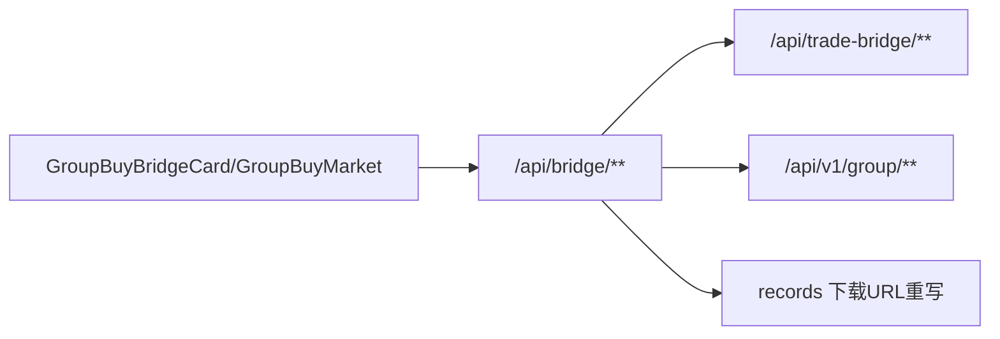

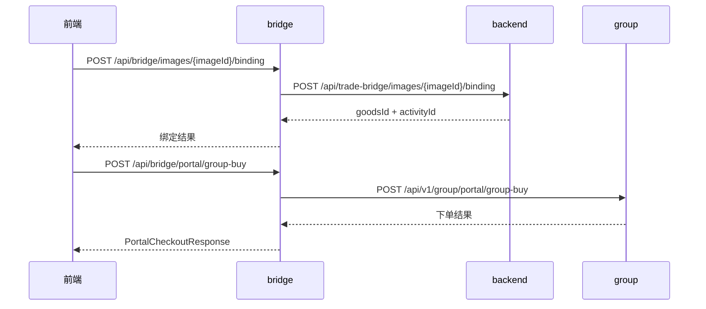

---

## 功能 9：交易域（group 六层架构：锁单、结算、拼团、退款、消息）

### 功能概述
该功能负责交易核心一致性。group 项目采用 API/Trigger/Domain/Infrastructure/Types/App 六层。主链路是 `lock -> settle -> team success/timeout -> refund`，并通过 `trade_user_record` 和 `trade_user_message` 对用户可见化。

### 业务流程（完整链路）
1. group 门户层接收 `direct-buy/group-buy` 请求，先解析当前用户并校验商品、活动、支付参数。
2. 交易主链路先执行 `lockOrder`：按 `outTradeNo` 做幂等锁，检查库存/活动状态，创建或复用订单与团队占位。
3. `lockOrder` 成功后进入扣款环节，扣减 `bus_gallery.app_user.balance_cents`（金额统一为分）。
4. 扣款成功后执行 `settleOrder`，订单状态推进到已支付，并更新团队进度（`lock_count/complete_count`）。
5. 若是直接购买，订单可立即标记可下载并写 `trade_user_record` 成功记录与消息。
6. 若是拼团购买，先写“等待成团”记录；达到目标人数时再批量刷新团队内记录为可下载并发成功消息。
7. 拼团下单前新增防重校验：若同一用户在同一 `goodsId + activityId` 已有进行中队列（`team.status=0` 且未过期），直接拒绝重复下单。
8. 每次关键状态变更都写 `trade_outbox_event`，由调度器异步投递 RabbitMQ，保证事件可重试、可追踪。
9. 定时任务持续扫描超时未成团团队，执行失败关团、订单退款、余额返还、失败消息写入。
10. 所有用户可见状态统一沉淀在 `trade_user_record` 与 `trade_user_message`，前端直接据此展示消息和交易记录。
11. 任意环节异常都按业务码返回，确保前端知道是参数问题、鉴权问题还是资金/交易状态问题。

### 接口清单（API 规范）
| API | 方法 | 认证 | 说明 |
|---|---|---|---|
| `/api/v1/group/index/config` | POST | 是（外部经 bridge） | 查询商品活动配置 |
| `/api/v1/group/trade/lock` | POST | 是 | 锁单 |
| `/api/v1/group/trade/settle` | POST | 是 | 结算 |
| `/api/v1/group/trade/refund` | POST | 是 | 退款 |
| `/api/v1/group/portal/teams` | GET | 是 | 活跃拼团 |
| `/api/v1/group/portal/direct-buy` | POST | 是 | 直接下单 |
| `/api/v1/group/portal/group-buy` | POST | 是 | 拼团下单 |
| `/api/v1/group/portal/messages` | GET | 是 | 用户消息 |
| `/api/v1/group/portal/records` | GET | 是 | 用户记录 |

### 数据结构（字段）
- `trade_goods`：`goods_id/image_id/vehicle_id/original_price/group_price/stock_available/status`
- `trade_activity`：`activity_id/goods_id/target_count/valid_minutes/status/start_time/end_time`
- `trade_order_team`：`team_id/activity_id/status/target_count/lock_count/complete_count/valid_end_time`
- `trade_order_item`：`order_id/out_trade_no/team_id/user_id/order_mode/pay_price/status`
- `trade_user_record`：`record_id/app_user_id/order_id/trade_status/can_download/pay_price`
- `trade_user_message`：`message_id/app_user_id/message_type/title/content/biz_record_id`
- `trade_outbox_event`：可靠事件投递（发布状态、重试）

### 界面 / 交互说明
交易页面是“强流程页面”：先绑定商品，再选择支付方式，再下单，再落地到消息与记录。拼团成功立即可下载，失败超时自动退款，交易记录可追溯。用户在“消息”页能看到直接下单成功、拼团中、拼团成功、拼团失败退款等状态。

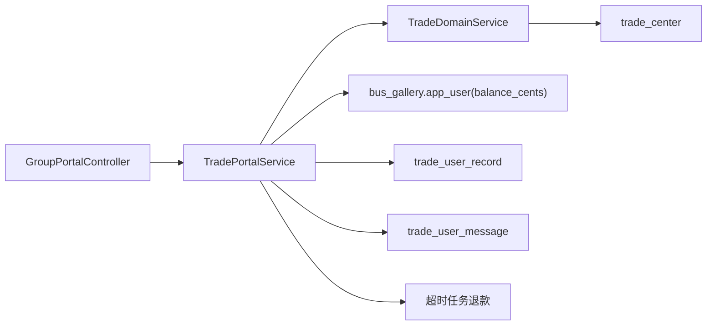

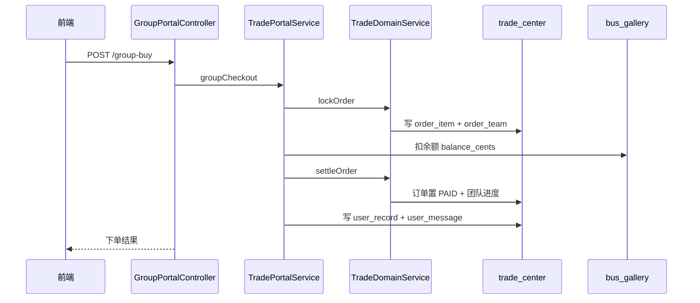

---

## 功能 10：工程化部署、配置管理、日志与可观测性

### 功能概述
该功能保障“可重复部署”和“可定位问题”。使用 docker-compose 一键启动完整栈；日志统一挂载到宿主 `./log/*`；各服务支持日志级别、pattern、滚动策略配置；网关与后端统一错误码结构便于前端处理。

### 业务流程（完整链路）
1. 开发或运维在 `docker/` 目录执行 `docker compose up -d`，一次性拉起数据库、中间件、Nacos、四个后端与前端容器。
2. MySQL 启动时按挂载 SQL 初始化 `bus_gallery` 与 `trade_center`，Redis/MinIO/RabbitMQ 分别完成基础服务就绪。
3. backend/group/bridge/gateway 读取各自 `application.yml + 环境变量`，建立与 DB、Redis、MQ、MinIO、Nacos 的连接并注册实例。
4. gateway 完成路由与鉴权过滤器装配，并通过 Nacos 发现 `bus-gallery` 与 `bus-gallery-bridge`；frontend（Nginx）完成静态资源与 `/api/**` 转发能力。
5. 用户请求进来后，Nginx 先限流再转发，gateway 再做会话鉴权与下游路由，形成稳定入口链路。
6. 运行期间日志按服务分目录落盘到 `./log/backend|group|bridge|gateway`，配合滚动策略控制文件大小与保留周期。
7. 压测窗口可通过环境变量和 Nginx 配置临时放宽限流与上传体积，压测后恢复默认配置。
8. 故障排查按“网关日志 -> 下游服务日志 -> 中间件日志”顺序定位，重点检查 401/429/502、签名密钥、连接池与限流命中。
9. 该部署流程保证了“本地复现、服务器部署、压测回放”三种场景使用同一套配置模型，降低环境漂移风险。

### 接口清单（API 规范）
此功能主要是部署能力，不新增业务 API；对外仍通过前述 `/api/**` 接口族访问。

### 数据结构（字段）
- 日志配置：`logging.level.*`、`logging.pattern.*`、`logging.file.name`、`rollingpolicy.*`
- 关键环境变量：
  - 数据库：`DB_URL/TRADE_DB_URL`
  - Redis：`REDIS_HOST/REDIS_PASSWORD`
  - MinIO：`MINIO_ENDPOINT/MINIO_BUCKET`
  - RabbitMQ：`RABBITMQ_*`
  - Nacos：`NACOS_SERVER_ADDR/NACOS_NAMESPACE/NACOS_GROUP`
  - 鉴权密钥：`GATEWAY_INTERNAL_AUTH_SECRET`
- 日志挂载：
  - `../log/backend:/app/logs`
  - `../log/group:/app/logs`
  - `../log/bridge:/app/logs`
  - `../log/gateway:/app/logs`

### 界面 / 交互说明
用户看不到部署细节，但会直接感知稳定性：接口超时、429、401、下载失败等都依赖这层配置质量。前端当前已对 401、429、短超时做了可恢复处理，后端返回统一错误结构，运维可通过日志快速定位链路。

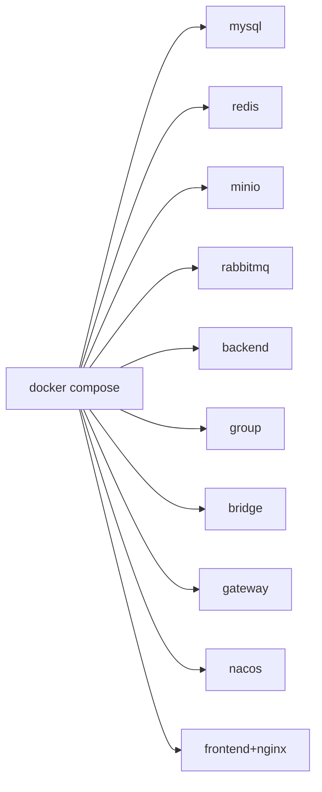

```mermaid
sequenceDiagram
    participant Dev as 运维/开发
    participant DC as docker compose
    participant NX as nginx
    participant GW as gateway
    participant S as backend/bridge/group
    Dev->>DC: docker compose up -d
    DC-->>Dev: 服务启动完成
    Dev->>NX: 浏览器访问 /
    NX->>GW: /api/**
    GW->>S: 路由转发
    S-->>GW: JSON/stream
    GW-->>NX: 统一返回
```

---

## 附录 A：前端页面与后端能力映射

| 页面/组件 | 主要接口 | 说明 |
|---|---|---|
| `Home.vue` | `/api/vehicles` | 热门图片瀑布流、滚动加载 |
| `Gallery.vue` | `/api/vehicles` | 12 条分页，页码写入 query |
| `CompanyCatalog.vue` | `/api/companies/{id}/model-summaries`、按需 `/api/vehicles` | 先汇总后明细，30 条明细分页 |
| `ModelCatalog.vue` | `/api/models/{id}/company-summaries`、按需 `/api/models/{id}/vehicles` | 懒加载公司车辆明细 |
| `Upload.vue` | `/api/upload`、`/api/upload/chunk/*` | 普通/分片上传 |
| `ReviewCenter.vue` | `/api/reviews/*` | 审核流程 |
| `AdminDashboard.vue` | `/api/admin/*` | 全局治理与批量删除 |
| `GroupBuyBridgeCard.vue` | `/api/bridge/images/{id}/binding`、`/api/bridge/portal/teams` | 详情页交易入口 |
| `GroupBuyMarket.vue` | `/api/bridge/index/config`、`/api/bridge/portal/direct-buy|group-buy` | 交易结算页（同商品拼团队列含自己时禁止重复下单） |
| `TradeDownload.vue` | `/api/bridge/purchases/{recordId}/download` | 自动下载原图 |

## 附录 B：数据库划分与跨域关联约束
- 内容域库：`bus_gallery`
  - 车辆、图片、用户、评论、收藏、审核。
- 交易域库：`trade_center`
  - 商品、活动、订单、团队、消息、记录、outbox。
- 关联方式：
  - 通过 `app_user_id`、`image_id`、`vehicle_id` 存值关联，不使用跨库外键。
  - 所有金额字段使用“分”（整型），禁止小数字段。

## 附录 C：重构落地验收清单（给其他 AI）
1. 是否保留统一入口：外部仅 `/api/**`，不直接暴露 backend/group/bridge。
2. 是否保留网关会话校验 + 内部签名头 + 下游验签。
3. 是否保留上传三版本图片（original/display/thumbnail）与受控访问。
4. 是否保留评论按车牌聚合、点赞幂等 `liked=true/false`。
5. 是否保留交易桥接流程：imageId -> goodsId/activityId 自动解析。
6. 是否保留 group 超时退款与用户消息记录。
7. 是否保留下载权限闸门：必须经 `recordId + can_download` 校验。
8. 是否保留 docker-compose 全栈启动与日志挂载。
9. 是否保留前端分页、懒加载与降载策略（避免全量查询）。
10. 是否保留统一错误结构 `{code,message,data}` 与前端恢复策略。
11. 是否保留 Nacos 注册发现链路（gateway lb 路由 + bridge OpenFeign 服务名调用）。

## 附录 D：拼团消息存储与消息队列模型补充

### 1. 消息在数据库里是“对象行”还是“JSON”？
- 用户站内消息不是以整块 JSON 存储，而是以关系型表的“对象行”形式落库在 `trade_center.trade_user_message`。
- 每条消息一行，核心字段包括：
  - `message_id`：消息主业务 ID
  - `app_user_id`：消息所属用户
  - `message_type`：消息类型，如 `GROUP_WAIT`、`GROUP_SUCCESS`、`GROUP_FAILED`
  - `title` / `content`：展示文案
  - `biz_record_id`：关联的交易记录 ID
  - `created_at`：创建时间
- 这意味着消息本身不是一个 JSON blob，而是结构化字段，便于按用户、类型、时间排序和去重。
- 只有领域事件 outbox 使用了 JSON 载荷：`trade_outbox_event.payload_json` 会保存订单事件内容，供后续 RabbitMQ 转发。

### 2. 这次“别人都显示已在队列中”的根因
- 后端防重本来就是按 `goodsId + activityId + userId` 精确判定，数据库查询没有把所有用户混在一起。
- 真正的问题在前端：
  - `GroupBuyMarket.vue` 里“是否已在队列”的查找曾经优先按 `goodsId` 命中；
  - 记录接口又没有直接返回 `activityId`，前端会用当前商品配置去推断活动；
  - 当同一商品存在不同活动，或旧记录被映射到当前活动时，就可能把其他用户场景误判成“已在队列”。
- 本次修复做了两件事：
  - `portal/records` 返回真实 `activityId`
  - 前端改成必须按 `goodsId + activityId` 精确匹配，避免跨活动误判

### 3. 项目的消息队列模型

```mermaid
flowchart LR
    FE["Frontend / GroupBuyMarket"] --> GW["Gateway"]
    GW --> BR["Bridge"]
    BR --> GP["Group PortalService"]
    GP --> DB1["trade_order_item / trade_order_team"]
    GP --> DB2["trade_user_record / trade_user_message"]
    GP --> OB["trade_outbox_event(payload_json)"]
    OB --> RELAY["RabbitOutboxRelayScheduler"]
    RELAY --> EX["Rabbit TopicExchange(group.trade.exchange)"]
    EX --> Q1["trade.order.locked.queue"]
    EX --> Q2["trade.order.settled.queue"]
    EX --> Q3["trade.order.refunded.queue"]
```

### 4. 队列链路说明
1. 前端发起拼团或直接购买，请求先经过 `gateway -> bridge -> group`。
2. `TradePortalService.groupCheckout` 先按 `userId + goodsId + activityId` 做防重复校验。
3. 交易主链路把订单、队伍状态写入 `trade_order_item`、`trade_order_team`。
4. 面向用户展示的“我的拼团记录”和“站内消息”分别写入 `trade_user_record`、`trade_user_message`。
5. 同一事务里，领域事件会写入 `trade_outbox_event`，这里的 `payload_json` 才是 JSON 形式。
6. 定时任务 `RabbitOutboxRelayScheduler` 轮询 outbox，把 `ORDER_LOCKED / ORDER_SETTLED / ORDER_REFUNDED` 转发到 RabbitMQ。
7. RabbitMQ 用 `TopicExchange + routingKey` 分发到对应队列，供后续异步消费者扩展通知、补偿或统计逻辑。

### 5. 为什么要分成“用户消息表”和“outbox 事件表”
- `trade_user_message` 面向页面展示，要求简单、可查、可去重，所以用结构化列存储。
- `trade_outbox_event` 面向服务间异步投递，事件字段可能扩展，所以用 `payload_json` 更灵活。
- 两者职责不同：
  - 前者解决“用户看见什么”
  - 后者解决“系统异步传播什么”

## 附录 E：根目录文档归并映射（2026-04-03）

| 原文档 | 已归并到 | 归并说明 |
|---|---|---|
| `API_DOCS.md` | `README.md` + 本文附录 G | 统一接口契约、错误码与联调示例摘要 |
| `BUSINESS_FLOWS.md` | 本文第 1~10 章 + 附录 G | 登录/浏览/快照/上传/互动等流程图与说明并入 |
| `ROUTE_CODE_GUIDE.md` | 本文附录 A + 附录 G | 路由到 Controller/Service/Mapper 的链路映射并入 |
| `UPLOAD_MODULE_FLOWS.md` | 本文“上传流程”相关章节 + 附录 G | 分片会话、幂等、降级、MinIO 三层对象策略并入 |
| `图片访问与MinIO安全流程.md` | 本文“图片访问与签名”相关章节 + 附录 G | 私有桶 + 临时签名 + 场景分发策略并入 |
| `审核与后台治理流程.md` | 本文“审核与治理”相关章节 + 附录 G | 工单流转、角色权限、后台治理链路并入 |
| `消息队列副作用流程.md` | 本文“RabbitMQ/副作用”相关章节 + 附录 G | afterCommit 事件与 best-effort 消费模型并入 |
| `认证与会话流程.md` | 本文“网关与会话”相关章节 + 附录 G | 会话校验、ThreadLocal 主体、降级策略并入 |
| `评论收藏与互动流程.md` | 本文“评论收藏”相关章节 + 附录 G | 事务内落库 + 缓存即时更新 + 异步副作用并入 |
| `车辆浏览与快照流程.md` | 本文“车辆浏览与快照”相关章节 + 附录 G | 列表缓存、快照构建锁、stale 兜底并入 |
| `技术难点.txt` | 本文“稳定性与高并发设计思路” + 附录 G | 技术风险与改进方向并入 |
| `file-list.txt` | 本文附录 G | 由“静态清单文件”改为“命令式生成方式”说明 |

## 附录 G：根目录文档精细归并摘要（2026-04-03）

### G.1 接口契约归并（来自 `API_DOCS.md`）
- 统一基础约定：`/api` 前缀、`Authorization: Bearer <token>`。
- 统一错误码语义：`00000/A0400/A0401/A0404/A0429/A0500/B0500/B0501`。
- 认证、用户、车辆、评论、收藏等典型请求/响应结构已并入本文对应业务章节。

### G.2 业务主流程归并（来自 `BUSINESS_FLOWS.md`）
- 登录会话：登录成功写 Redis 会话，受保护接口由鉴权拦截器校验。
- 车辆列表：筛选参数参与 Redis 键，版本号控制缓存自然失效。
- 详情快照：按车牌聚合并缓存，命中快照减少多接口拼装。
- 上传、评论、收藏、审核等流程的 Mermaid 已合并到本文主章节。

### G.3 路由到后端链路归并（来自 `ROUTE_CODE_GUIDE.md`）
- 已把“前端页面/组件 -> API -> Controller -> Service -> Mapper”的映射收敛到附录 A。
- 覆盖 `Gallery/VehicleDetail/Login/Upload/UserProfile/Admin` 等核心页面链路。

### G.4 上传模块细节归并（来自 `UPLOAD_MODULE_FLOWS.md`）
- 分片上传四阶段：`init -> part -> progress -> complete`。
- `complete` 阶段统一幂等防重并执行最终业务落库。
- Redis 会话异常时保留本地会话兜底，降低链路中断概率。
- 图片写入保持三层对象：`original/display/thumbnail`。

### G.5 图片安全访问归并（来自 `图片访问与MinIO安全流程.md`）
- 私有桶访问模型：前端拿短期 token，不直接暴露长期对象地址。
- `GET /api/images/access/{token}` 负责验签、过期校验、回源流式输出。
- 前端场景约定固定：列表缩略图，详情/审核受控高清图。

### G.6 审核与治理归并（来自 `审核与后台治理流程.md`）
- 普通用户提交 `vehicle_submission(PENDING)`，审核通过后再落正式表。
- 审核员按区域权限处理，站长可跨区域全局治理。
- 后台评论治理与前台删除复用同一服务层，保证行为一致。

### G.7 评论收藏互动归并（来自 `评论收藏与互动流程.md`）
- 评论：事务内写库 + bump 评论版本键；事务后发 `comment.created`。
- 收藏：事务内 toggle + summary/liked 覆盖写；事务后发 `favorite.toggled`。
- 主流程优先 MySQL 结果，副作用采用 best-effort 不反压主链路。

### G.8 消息队列副作用归并（来自 `消息队列副作用流程.md`）
- `afterCommit` 发布事件，避免“数据库回滚但消息已发”。
- Topic Exchange + 业务队列 + DLQ；异常消息进死信，降低反复重试风险。
- 消费侧副作用失败仅记录日志，保留主链路可用性。

### G.9 认证与会话归并（来自 `认证与会话流程.md`）
- 会话主存储 Redis，异常时允许本地会话兜底。
- 鉴权上下文统一收敛到 `AuthPrincipal`，请求结束后清理 ThreadLocal。
- 登录、发码、人机校验与限流职责边界已并入主文档。

### G.10 浏览与快照归并（来自 `车辆浏览与快照流程.md`）
- 列表使用“参数键 + 版本号”缓存模型。
- 快照使用构建锁 + stale 兜底，降低热点重建抖动。
- 热门排序以 `viewCount` 为主，保留后续批量聚合优化空间。

### G.11 技术难点归并（来自 `技术难点.txt`）
- 重点难点：大文件上传弹性、缓存一致性、资源安全、耗时任务异步化、可观测性。
- 改进方向：预签名直传、任务队列、病毒扫描、幂等补偿、状态化监控。

### G.12 文件清单归并（来自 `file-list.txt`）
- 原根目录静态清单文件已移除，改为命令式即时生成：
  - PowerShell：`Get-ChildItem -Recurse -File | Select-Object -ExpandProperty FullName`
  - Git：`git ls-files`

## 附录 H：MySQL 慢查询调优记录（2026-04-03）

### H.1 现有慢日志配置（Docker Compose）
当前仓库 `docker/docker-compose.yml` 已开启 MySQL 慢查询：
- `--long_query_time=0.1`
- `--slow_query_log=1`
- `--log_queries_not_using_indexes=1`
- `--slow_query_log_file=/var/lib/mysql/slow.log`

对应位置：`docker/docker-compose.yml:13-16`。

### H.2 本次取慢日志过程与环境限制
本次按“进入容器读取 `/var/lib/mysql/slow.log`”执行，但当前会话对 Docker 引擎管道无访问权限，命令返回：
- `open //./pipe/dockerDesktopLinuxEngine: Access is denied`

因此本次无法直接拿到容器内 `slow.log` 原文。为保证文档可落地，改用以下两条线并行分析：
1. 基于真实 SQL 调用路径（Mapper XML + `TradePortalService`）做慢查询候选筛查。
2. 基于当前表结构与索引（`docker/init/init.sql`、`docker/init/trade_center.sql`）评估命中情况与缺口。

### H.3 已定位的高风险慢查询形态

#### H.3.1 内容域（`bus_gallery`）
1. 车辆分页与计数复杂过滤：
- SQL 位置：`backend/src/main/resources/mapper/VehicleMapper.xml:182`（`selectPageByCursor`）、`:259`（`count`）
- 风险点：
  - 多个 `EXISTS` 子查询
  - `LIKE '%keyword%'` 前导通配符
  - `ORDER BY CASE WHEN launch_date IS NULL ...`
2. 随机取样：
- SQL 位置：`VehicleMapper.xml:173-179`
- 风险点：`ORDER BY RAND()` 在大表上会全表排序。
3. 图片上传者分页：
- SQL 位置：`backend/src/main/resources/mapper/ImageMapper.xml:126`
- 风险点：`WHERE uploader_id` + `ORDER BY created_at DESC, id DESC`，且包含子查询聚合 `vehicle_image`。
4. 评论分页：
- SQL 位置：`backend/src/main/resources/mapper/VehicleCommentMapper.xml:40`、`:54`
- 风险点：按 `vehicle_id`/`plate_number` 查询后再按 `created_at,id` 排序，当前索引不覆盖排序列。
5. 收藏分页：
- SQL 位置：`backend/src/main/resources/mapper/VehicleFavoriteMapper.xml:36`
- 风险点：`WHERE user_id` + `ORDER BY created_at DESC`，当前仅有 `(vehicle_id,user_id)` 唯一索引和 `vehicle_id` 索引。

#### H.3.2 交易域（`trade_center`）
1. 拼团大厅活跃团队：
- SQL 位置：`group/group-trigger/src/main/java/com/busgallery/groupbuy/trigger/service/TradePortalService.java:54-69`
- 风险点：`status + valid_end_time + created_at` 复合过滤/排序，现有索引对排序支持不足。
2. “是否已在拼团队列”校验：
- SQL 位置：`TradePortalService.java:421-424`
- 风险点：`trade_order_item` 多条件筛选 + `JOIN trade_order_team`，需要更贴合查询路径的联合索引。
3. 记录刷新与失败消息补偿：
- SQL 位置：`TradePortalService.java:439-444`、`:594-606`
- 风险点：`trade_user_record` 以 `app_user_id + order_mode + trade_status + team_id` 过滤/关联，当前索引维度不足。
4. 超时队伍扫描：
- SQL 位置：`TradePortalService.java:332`
- 风险点：`WHERE status=0 AND valid_end_time < NOW() ORDER BY valid_end_time`，建议复合索引避免回表扫描放大。

### H.4 当前索引基线（节选）
- `vehicle`：`idx_vehicle_model/company/region/view_count`（`docker/init/init.sql:78-81`）
- `image`：`idx_image_uploader`（`init.sql:141`）
- `trade_order_team`：`idx_trade_order_team_activity_status`、`idx_trade_order_team_valid_end`（`trade_center.sql:111,113`）
- `trade_order_item`：`idx_trade_order_item_user_status/team_status/activity_status/goods_status`（`trade_center.sql:147-150`）
- `trade_user_record`：`idx_trade_user_record_user_created`（`trade_center.sql:225`）

### H.5 推荐索引优化（按优先级）

#### P0（先做，收益高）
```sql
-- bus_gallery: 收藏分页与统计
ALTER TABLE vehicle_favorite
  ADD INDEX idx_vehicle_favorite_user_created (user_id, created_at, vehicle_id);

-- bus_gallery: 评论分页（按车辆 / 车牌）
ALTER TABLE vehicle_comment
  ADD INDEX idx_vehicle_comment_vehicle_created (vehicle_id, created_at, id),
  ADD INDEX idx_vehicle_comment_plate_created (plate_number, created_at, id);

-- bus_gallery: 上传者作品流分页
ALTER TABLE image
  ADD INDEX idx_image_uploader_created (uploader_id, created_at, id);

-- trade_center: 活跃团队 + 超时扫描
ALTER TABLE trade_order_team
  ADD INDEX idx_team_status_valid_end_created (status, valid_end_time, created_at),
  ADD INDEX idx_team_activity_status_valid_end_created (activity_id, status, valid_end_time, created_at);

-- trade_center: 防重复下单查询
ALTER TABLE trade_order_item
  ADD INDEX idx_item_user_mode_goods_act_status_team (user_id, order_mode, goods_id, activity_id, status, team_id);

-- trade_center: 用户记录刷新与补偿
ALTER TABLE trade_user_record
  ADD INDEX idx_record_user_mode_status_team (app_user_id, order_mode, trade_status, team_id);
```

#### P1（第二批）
```sql
-- bus_gallery: 最新图片流
ALTER TABLE image
  ADD INDEX idx_image_created_id (created_at, id);

-- bus_gallery: 热门车辆排序
ALTER TABLE vehicle
  ADD INDEX idx_vehicle_view_id (view_count, id);

-- trade_center: team 关联更新/查询兜底
ALTER TABLE trade_user_record
  ADD INDEX idx_record_team_id (team_id);
```

### H.6 查询改写建议（比“只加索引”更关键）
1. `ORDER BY RAND()`（`VehicleMapper.xml:178`）改为“两段式随机”：
- 先按条件取 `id` 区间或采样 id 集合，再按随机 id 回表 1 条。
2. `LIKE '%keyword%'` 组合检索（`VehicleMapper.xml:207+`）：
- 长期建议做检索索引（ES / Mroonga / 维护冗余检索表 + FULLTEXT）；
- 短期可增加“前缀匹配”入口（`keyword%`）以便命中 B-Tree。
3. `ORDER BY CASE WHEN launch_date IS NULL ...`：
- 建议引入计算列（如 `launch_null_flag`）并联合索引，减少 filesort。

### H.7 验证方法（上线前后必须执行）
1. 采样慢日志 TopN（容器内）：
```bash
docker exec -it bus-gallery-mysql sh -lc "mysqldumpslow -s t -t 30 /var/lib/mysql/slow.log"
```
2. 对 Top SQL 执行：
```sql
EXPLAIN ANALYZE <slow_sql>;
```
3. 关注指标：
- `rows examined` 明显下降
- `Using filesort` / `Using temporary` 消失或显著减少
- P95/P99 延迟下降
4. 应用内辅助观测：
- `GET /api/metrics/db` 查看 `slowSamples`（`backend/src/main/java/com/busgallery/busgallery/metrics/DbMetricsController.java`）
- `busgallery.metrics.slow-query-ms`（`backend/src/main/resources/application.yml:160`）可临时下调到 `100` 做压测窗口观测

### H.8 回滚与风险控制
1. 单索引逐步上线，避免一次性叠加导致写入放大不可控。
2. 每加一个索引都保留对照窗口（至少 30 分钟业务高峰）。
3. 观察写入 RT、锁等待、磁盘增长；不达预期立即 `DROP INDEX` 回滚。
4. 对交易核心表（`trade_order_item`、`trade_order_team`）优先在低峰执行 DDL。

## 附录 I：调优（基于真实 slow.log 的索引收敛与实测）

### I.1 执行时间与目标
- 执行日期：2026-04-03
- 目标：按真实慢日志 Top SQL 做“精准加索引”，并给出加索引前后性能对比。

### I.2 慢日志获取与环境确认
1. 容器确认：
```bash
docker ps
```
确认 `bus-gallery-mysql` 运行中。

2. 按文档命令取 TopN：
```bash
docker exec -it bus-gallery-mysql sh -lc "mysqldumpslow -s t -t 30 /var/lib/mysql/slow.log"
```
结果：容器内未安装 `mysqldumpslow`（`command not found`）。

3. 改为直接拉取真实日志原文：
```bash
docker cp bus-gallery-mysql:/var/lib/mysql/slow.log .tmp/slow.log
```

4. 慢查询配置核验：
```sql
SHOW VARIABLES LIKE 'slow_query_log';
SHOW VARIABLES LIKE 'slow_query_log_file';
SHOW VARIABLES LIKE 'long_query_time';
SHOW VARIABLES LIKE 'log_queries_not_using_indexes';
```
结果：
- `slow_query_log=ON`
- `slow_query_log_file=/var/lib/mysql/slow.log`
- `long_query_time=0.100000`
- `log_queries_not_using_indexes=ON`

### I.3 本次落地的索引（已执行）
```sql
ALTER TABLE trade_center.trade_order_team
  ADD INDEX idx_team_status_end_team (status, valid_end_time, team_id);

ALTER TABLE trade_center.trade_user_record
  ADD INDEX idx_record_mode_status_user_record_team
  (order_mode, trade_status, app_user_id, record_id, team_id);

ALTER TABLE trade_center.trade_order_item
  ADD INDEX idx_item_team_status_mode (team_id, status, order_mode);

ALTER TABLE bus_gallery.image
  ADD INDEX idx_image_uploader_created_id (uploader_id, created_at, id);

ALTER TABLE bus_gallery.region
  ADD INDEX idx_region_parent_name (parent_id, name);

ALTER TABLE bus_gallery.company
  ADD INDEX idx_company_region_name (region_id, name);

ALTER TABLE bus_gallery.model
  ADD INDEX idx_model_brand_name (brand_id, name);
```

### I.4 加索引前后性能对比（EXPLAIN ANALYZE 实测）
说明：以下耗时取 `EXPLAIN ANALYZE` 顶层节点 `actual time=..` 的结束值，作为同机同库对照样本。

| Query | 场景 | 加索引前 (ms) | 加索引后 (ms) | 提升倍数 |
|---|---|---:|---:|---:|
| Q1 | 超时队伍扫描 `trade_order_team` | 1006 | 29 | 34.69x |
| Q2 | 拼团失败消息补偿扫描 `trade_user_record` | 2971 | 297 | 10.00x |
| Q3 | 超时退款联表筛选 | 1956 | 625 | 3.13x |
| Q4 | 上传者图片流（含 `vehicle_image` 聚合） | 8545 | 8342 | 1.02x |
| Q5 | 地区子节点排序 `region` | 898 | 16 | 56.12x |
| Q6 | 公司列表排序 `company` | 2107 | 30 | 70.23x |
| Q7 | 车型列表排序 `model` | 1596 | 51 | 31.29x |

### I.5 计划层面的变化（关键）
1. `Q1`：`Table scan + Sort` -> `Covering index range scan(idx_team_status_end_team)`，并去掉 filesort。
2. `Q2`：`trade_user_record` 从全表扫描 -> 命中 `idx_record_mode_status_user_record_team(order_mode, trade_status, ...)`。
3. `Q5/Q6/Q7`：均从 `Table scan + Sort` -> 覆盖索引扫描（排序与过滤由索引完成）。
4. `Q4`：主表 `image` 已命中 `idx_image_uploader_created_id`，但总耗时仍主要受 `vehicle_image GROUP BY` 物化子查询影响，因此整体下降有限。
5. `Q3`：联表查询耗时明显下降，但当前样本下优化器仍可能从 `trade_order_item` 扫描起步，后续可通过 SQL 改写/驱动表约束继续收敛。

### I.6 代码与初始化脚本同步
为避免“容器重建后索引丢失”，已将索引定义同步进初始化脚本：
- `docker/init/trade_center.sql`
  - `trade_order_team` 新增 `idx_team_status_end_team`
  - `trade_order_item` 新增 `idx_item_team_status_mode`
  - `trade_user_record` 新增 `idx_record_mode_status_user_record_team`
- `docker/init/init.sql`
  - `image` 新增 `idx_image_uploader_created_id`
  - `region` 新增 `idx_region_parent_name`
  - `company` 新增 `idx_company_region_name`
  - `model` 新增 `idx_model_brand_name`

### I.7 下一步可继续收敛点
1. `Q4`（图片流）若要进一步下降，需要优先优化 `vehicle_image` 聚合子查询（例如按业务改为预计算关联/减少运行时聚合）。
2. `vehicle` 的 `ORDER BY CASE WHEN launch_date IS NULL ...` 仍建议走“生成列 + 联合索引”方案，单纯普通索引收益有限。

