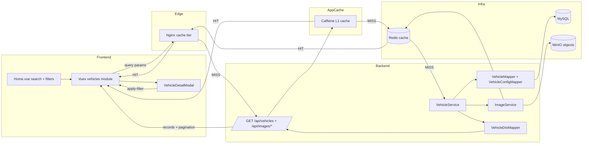
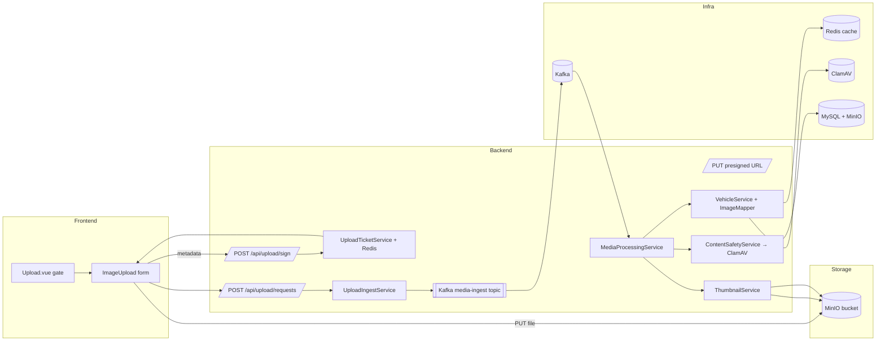

# Bus Gallery Business Flowcharts

Each section pairs a short explanation with a Mermaid flowchart so you can see how the Vue frontend, Spring Boot backend, and infrastructure interact for the major user journeys. Update these diagrams whenever the touchpoints listed below change.

## 1. User Authentication and Session Lifecycle

**Key touchpoints**: `frontend/src/views/Login.vue`, `frontend/src/views/Register.vue`, `frontend/src/store/modules/auth.js`, `frontend/src/api/axiosInstance.js`, `backend/src/main/java/com/busgallery/busgallery/controller/AuthController.java`, `backend/src/main/java/com/busgallery/busgallery/auth/*.java`.

```mermaid
flowchart LR
    subgraph Frontend
        A[Login / Register views]
        B[Vuex auth module]
        C[localStorage + axios interceptors]
    end
    subgraph Backend
        D[/POST /api/auth/* (AuthController)/]
        E[UserService + PasswordEncoder]
        F[AuthTokenService]
        G[LoginInterceptor plus TokenRefreshInterceptor]
    end
    subgraph Infra
        H[(MySQL)]
        I[(Redis token buckets)]
    end
    A --> B --> C
    C -- submit credentials --> D
    D --> E --> H
    E --> D
    D --> F --> I
    F -->|token + TTL| C
    C -- attaches Bearer token --> G
    G --> F
    G --> D
    G -->|invalid token => 401| C
```

- Vuex persists `bus_gallery_token` / `bus_gallery_user` and axios injects `Authorization` headers.
- Auth endpoints create or validate accounts against MySQL, while `AuthTokenService` stores sessions in Redis and refreshes TTL on every request via `TokenRefreshInterceptor`.
- `LoginInterceptor` enforces auth for uploads, vehicle mutations, and `/api/users/me`; failed checks erase client storage and redirect to `/login`.

## 2. Vehicle Gallery Search with Nginx→Redis→Tomcat Caching

**Key touchpoints**: `frontend/src/views/Home.vue`, `frontend/src/store/modules/vehicles.js`, `frontend/src/components/Gallery/VehicleDetailModal.vue`, `backend/.../controller/VehicleController.java`, `backend/.../controller/ImageController.java`, `backend/.../service/VehicleService.java`, `backend/.../service/ImageService.java`.



- Home view dispatches `vehicles/loadVehicleGallery`, which first hits the Nginx cache; on a miss, the request lands in the service layer where a local Caffeine cache is checked before falling back to Redis and finally MySQL/MinIO.
- `ImageController` adds `Cache-Control: public` headers so Nginx can honor the top-tier cache, while Redis provides the shared middle tier and the in-process Caffeine layer absorbs ultra-hot keys.
- Any filter applied inside the modal feeds back into the Vuex module, which re-fetches the gallery with updated query params.

## 3. Vehicle Upload + Media Pipeline (Presigned Kafka Flow)

**Key touchpoints**: `frontend/src/views/Upload.vue`, `frontend/src/components/Upload/ImageUpload.vue`, `frontend/src/api/upload.js`, `backend/.../controller/UploadController.java`, `backend/.../service/upload/*`, `backend/.../service/media/MediaProcessingService.java`, `backend/.../messaging/*`, `docker/docker-compose.yml` (Kafka, Redis, ClamAV).



- 表单提交首先调用 `/api/upload/sign` 获取带有效期的 MinIO 签名，同时 Redis 保存 ticket 以防伪造。
- 浏览器直接使用签名 URL 将二进制推送到对象存储，随后向 `/api/upload/requests` 仅登记元数据和 ticket，接口立即返回任务 ID。
- `UploadIngestService` 将任务写入 `media_ingest_job` 表并发布到 Kafka，前端进入轮询状态，通过 `/api/upload/jobs/{id}` 展示实时状态并支持失败重试。
- `MediaProcessingService` 消费 Kafka 消息：下载原图 → `ContentSafetyService` 调用 ClamAV 病毒/木马扫描 → `ExifMetadataExtractor` 判定是否含 GPS 等敏感信息，如不合规直接隔离并标记 `scan_status`。
- 合规任务生成多规格缩略图，写回 MinIO，同时把 EXIF、处理状态、缩略图 JSON 等写入 `image` 表，再由 `VehicleService.create` 完成车辆与图片的归档/索引并驱逐 Redis/Caffeine 缓存。
- Nginx → Redis → Tomcat 的多级缓存仍用于 GET 查询，但上传链路完全脱钩，任务完成后后台通知即可刷新页面。## 4. Region → Company Hierarchy Navigation

**Key touchpoints**: `frontend/src/views/RegionCatalog.vue`, `frontend/src/store/modules/regions.js`, `frontend/src/views/CompanyCatalog.vue`, `backend/.../controller/RegionController.java`, `backend/.../controller/CompanyController.java`.

```mermaid
flowchart LR
    subgraph Frontend
        R1[RegionCatalog.vue]
        R2[Vuex regions module]
        R3[CompanyCatalog.vue / router links]
    end
    subgraph Backend
        S1[/GET /api/regions + /api/regions/hierarchy/]
        S2[RegionService]
        S3[CompanyService]
        S4[/GET /api/companies, /{id}/model-summaries/]
    end
    subgraph Infra
        DB[(regions, companies, vehicles tables)]
    end
    R1 -->|dispatch loadRegionCatalog| R2
    R2 --> S1 --> S2 --> DB
    S2 -->|province + city tree| R2 --> R1
    R1 -->|city click| R3
    R3 -->|needs details| S4 --> S3 --> DB
    S3 -->|company + vehicle summaries| R3
```

- `regions/loadRegionCatalog` first ensures the flat list is cached (for pickers like the upload form) then fetches `/api/regions/hierarchy`, which joins companies per city on the backend; in-process Caffeine plus Redis L2 caches sit in front of the region/company services, so most requests never touch MySQL.
- Selecting a city routes to company cards and deeper catalog pages, which rely on `/api/companies`, `/companies/{id}`, `/companies/{id}/vehicles`, and `/companies/{id}/model-summaries` for thumbnails/specs.
- Backend services reuse MyBatis mappers and hydrate province/city metadata so the UI can show badges, counts, and jump links without extra calls.

## 5. User Profile & Personal Gallery

**Key touchpoints**: `frontend/src/views/UserProfile.vue`, `frontend/src/store/modules/users.js`, `frontend/src/views/Account.vue`, `backend/.../controller/UserController.java`, `backend/.../service/ImageService.java`.

```mermaid
flowchart LR
    subgraph Frontend
        P1[UserProfile route]
        P2[Vuex users module]
        P3[VehicleDetailModal]
        P4[Vuex vehicles module]
    end
    subgraph Backend
        Q1[/GET /api/users/{username}/]
        Q2[/GET /api/users/{username}/images]
        Q3[UserService]
        Q4[ImageService (Redis cache)]
        Q5[VehicleController detail endpoint]
    end
    subgraph Infra
        DB[(users, images, vehicle relations)]
        OBJ[(MinIO)]
        RC[(Redis cache)]
    end
    P1 --> P2
    P2 -- profile request --> Q1 --> Q3 --> DB
    Q1 --> P2 --> P1
    P2 -- gallery request --> Q2 --> Q4 --> RC
    Q4 --> DB
    Q4 --> OBJ
    P1 -->|click image with vehicleId| P3 --> P4 --> Q5 --> DB
```

- Visiting `/users/:username` triggers `users/loadProfile` plus paginated `users/loadUserGallery`; uploader stats like `imageCount` come from backend aggregation.
- Each image exposes uploader metadata and optional `vehicleId`; clicking launches `VehicleDetailModal`, which reuses the `vehicles` module + `/api/vehicles/{id}` to show configurations and cross-navigation buttons.
- Authenticated users hit `/api/users/me` via Account.vue to manage their own uploads with the same data pipeline, gated by `LoginInterceptor`.

