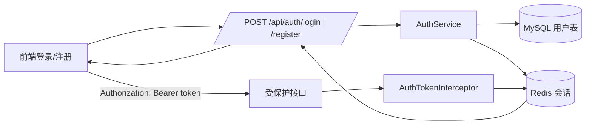
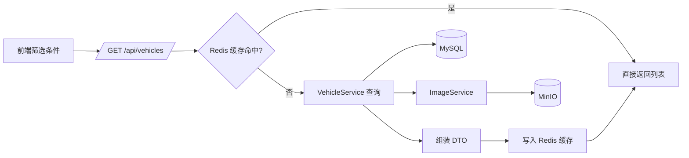
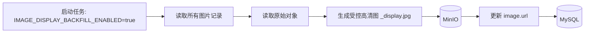
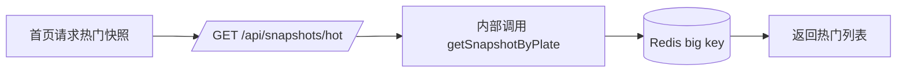

# Bus Gallery 业务流程

本文用中文描述各模块运行流程，并配套 Mermaid 流程图，便于理解前后端与基础设施之间的协作。

---

## 1. 登录 / 会话管理



要点：
- 登录成功后返回 `token`，前端存储并在请求头中携带。
- Redis 保存会话，`@RequireLogin` 接口会校验 token。

---

## 2. 车辆列表筛选与 Redis 缓存



要点：
- 缓存 key 包含筛选条件与游标参数，TTL 60 秒。
- 版本号 `bg:vehicle:page:version` 变更后旧缓存自动失效。

---

## 3. 车辆详情快照（Redis big key）

```mermaid
flowchart LR
    A[点击车辆卡片] --> B[/GET /api/snapshots/plate/{plate}/]
    B --> C{Redis 快照命中?}
    C -- 是 --> D[返回快照 JSON]
    C -- 否 --> E[查询同牌车辆]
    E --> F[(MySQL + MinIO)]
    E --> G[评论/收藏摘要]
    G --> H[(MySQL)]
    E --> I[拼装快照]
    I --> J[写入 Redis big key]
    J --> D
```

要点：
- 快照包含：车辆变体、图片、评论、收藏摘要、推荐。
- 前端优先消费快照，减少多次接口请求。

---

## 4. 上传流程（图片 + 车辆）

```mermaid
flowchart LR
    A[上传表单] --> B[/POST /api/upload/]
    B --> C[IdempotencyService]
    C --> D[ImageService 上传]
    D --> E[(MinIO)]
    D --> F[受控高清图生成(强水印)]
    D --> G[缩略图生成]
    F --> E
    G --> E
    B --> V[VehicleService.create]
    V --> H[(MySQL)]
    H --> I[返回车辆详情]
```

要点：
- 支持 `Idempotency-Key`，避免重复提交。
- 上传时会生成三层对象：原始对象、受控高清图、缩略图，并写回图片表。
- 前端场景分发：普通浏览页用缩略图；详情页和审核页用受控高清图。

---

## 5. 评论与收藏（含删除与异步副作用）

```mermaid
flowchart TD
    A[前端组件触发]
    A1[VehicleDetail.vue 桌面右侧评论区]
    A2[VehicleDetailModal.vue 桌面右侧评论抽屉]
    A3[UserProfile.vue 收藏卡片进入详情]
    A --> A1
    A --> A2
    A --> A3

    A1 --> B1[/POST /api/vehicles/{vehicleId}/comments/]
    A1 --> B2[/DELETE /api/vehicles/{vehicleId}/comments/{commentId}/]
    A2 --> B1
    A2 --> B2
    A1 --> C1[/POST /api/favorites/{vehicleId}/toggle/]
    A2 --> C1

    B1 --> D[(MySQL vehicle_comment)]
    B2 --> D
    C1 --> E[(MySQL vehicle_favorite)]

    B1 --> R1[(Redis bg:comments:ver:{vehicleId})]
    B2 --> R1
    C1 --> R2[(Redis bg:fav:summary/bg:fav:liked)]

    B1 --> MQ1[[RabbitMQ comment.created]]
    C1 --> MQ2[[RabbitMQ favorite.toggled]]
    MQ1 --> S1[通知/敏感词复审/热度/推荐/快照预热]
    MQ2 --> S2[榜单聚合/推荐更新/通知]
```

要点：
- 评论与收藏均受 `@RequireLogin` 保护。
- 评论删除权限：评论作者本人可删；`STATION` 站长可删任意评论；其他用户不可删。
- 评论缓存策略：新增/删除评论都会 `INCR bg:comments:ver:{vehicleId}`，列表与计数缓存按版本自然切换。
- 收藏缓存策略：toggle 后覆盖写 `bg:fav:summary:{vehicleId}` 与 `bg:fav:liked:{vehicleId}:{userId}`，写后读立即一致。
- 前端收藏一致性：详情页和详情弹窗都会主动拉取 `/api/favorites/{vehicleId}/summary`；从收藏夹进详情会强制刷新 detail，避免旧快照导致 `liked` 假阴性。
- RabbitMQ 消费器采用 best-effort：副作用失败只记录日志，不反抛阻塞主链路（例如 Redis 暂时 `MISCONF` 时，主事务仍以 MySQL 结果为准）。

组件级调用细节：
- `VehicleDetail.vue`
  - 电脑端：右侧 `comment-column` 默认显示评论（含删除按钮）。
  - 移动端：`mobile-comments` 展示评论与输入框。
  - 评论轮询：8 秒拉取一次（登录态）。
- `VehicleDetailModal.vue`
  - 电脑端：`comment-drawer` 固定在弹窗右侧。
  - 移动端：评论区内嵌在详情信息下方。
- `UserProfile.vue`
  - 从收藏列表进入详情时强制 detail 刷新，避免旧快照里的 `favoriteSummary` 造成误判。

Spring / Redis / RabbitMQ 交互时机（发布评论）：
1. `CommentController` 进入 `VehicleCommentServiceImpl.addComment()`，事务内写 `vehicle_comment`。
2. 同步执行 `INCR bg:comments:ver:{vehicleId}`。
3. 事务提交后，`BusEventPublisher` 执行 `afterCommit`，发送 `comment.created`。
4. `CommentCreatedEventConsumer` 异步触发通知、敏感词、热度、推荐、快照预热。

Spring / Redis / RabbitMQ 交互时机（收藏切换）：
1. `FavoriteServiceImpl.toggle()` 事务内 insert/delete `vehicle_favorite`。
2. 同步覆盖写 `bg:fav:summary:{vehicleId}` 与 `bg:fav:liked:{vehicleId}:{userId}`。
3. 事务提交后发送 `favorite.toggled`。
4. `FavoriteToggledEventConsumer` 异步更新榜单、推荐信号与通知。

额外说明：
- 该互动链路不直接访问 MinIO（图片对象存储主要在上传/签名访问链路）。
- 互动主链路以“先 MySQL 成功，再做异步副作用”为准；副作用失败不会反向影响用户成功响应。

可能性能问题与建议：
- 热点车辆评论量很大时，`count/list` 回源频繁：建议优先扩容 Redis、优化评论分页大小。
- 热点车辆收藏频繁切换会集中写同一车聚合键：可加批处理聚合或分桶热度计算。
- 轮询会产生稳定读压：后续可升级为增量拉取或 WebSocket 推送。

---

## 6. 历史高清图回填任务



要点：
- 用于历史数据补齐受控高清图，消除旧数据在详情页误回退到缩略图/原图的风险。

---

## 7. 首页热门快照



要点：
- 热门快照复用同一套 Redis big key 逻辑。

---

## 8. 站长后台评论管理

```mermaid
flowchart LR
    A[AdminDashboard.vue 评论管理区块] --> B[/GET /api/admin/comments?page&size/]
    A --> C[/DELETE /api/admin/comments/{commentId}/]
    B --> D[AdminController.listComments]
    C --> E[AdminController.deleteComment]
    D --> F[(MySQL vehicle_comment)]
    E --> G[VehicleCommentService.deleteComment]
    G --> F
    G --> H[(Redis bg:comments:ver:{vehicleId})]
```

要点：
- 后台评论删除与前台删除复用同一服务方法，权限、缓存失效逻辑一致。
- 站长后台适合做内容治理、误发清理、敏感评论处置，不影响普通用户的“本人可删”能力。
- 后台评论分页是 `created_at DESC, id DESC`，大规模数据建议确认 `created_at` 索引可用，避免深页退化。
- 删除后统一 bump 评论版本键，下一次详情页/弹窗拉取评论会自动切到新版本缓存。

---

> 当业务流程有调整时，请同步更新本文件。
