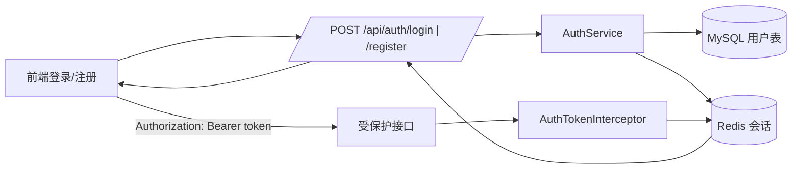
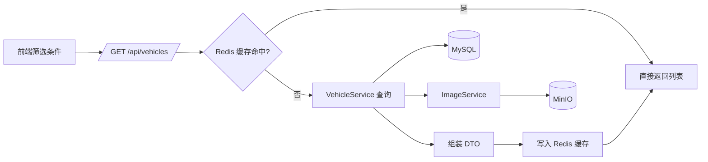
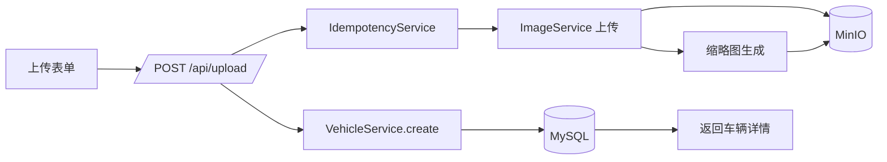
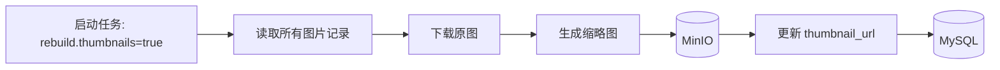
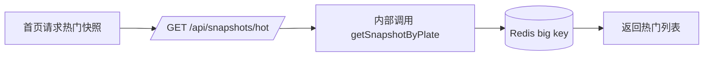

# Bus Gallery 业务流程

本文用中文描述各模块运行流程，并配套 Mermaid 流程图，便于理解前后端与基础设施之间的协作。

---

## 1. 登录 / 会话管理



要点：
- 登录成功后返回 `token`，前端存储并在请求头中携带。
- Redis 保存会话，`@RequireLogin` 接口会校验 token。

---

## 2. 车辆列表筛选与 Redis 缓存



要点：
- 缓存 key 包含筛选条件与游标参数，TTL 60 秒。
- 版本号 `bg:vehicle:page:version` 变更后旧缓存自动失效。

---

## 3. 车辆详情快照（Redis big key）

```mermaid
flowchart LR
    A[点击车辆卡片] --> B[/GET /api/snapshots/plate/{plate}/]
    B --> C{Redis 快照命中?}
    C -- 是 --> D[返回快照 JSON]
    C -- 否 --> E[查询同牌车辆]
    E --> F[(MySQL + MinIO)]
    E --> G[评论/收藏摘要]
    G --> H[(MySQL)]
    E --> I[拼装快照]
    I --> J[写入 Redis big key]
    J --> D
```

要点：
- 快照包含：车辆变体、图片、评论、收藏摘要、推荐。
- 前端优先消费快照，减少多次接口请求。

---

## 4. 上传流程（图片 + 车辆）



要点：
- 支持 `Idempotency-Key`，避免重复提交。
- 上传时自动生成缩略图并写回图片表。

---

## 5. 评论与收藏

```mermaid
flowchart LR
    A[前端评论/收藏操作] --> B[/POST /api/vehicles/{id}/comments/]
    A --> C[/POST /api/favorites/{id}/toggle/]
    B --> D[(MySQL 评论表)]
    C --> E[(MySQL 收藏表)]
    C --> F[/GET /api/favorites/{id}/summary/]
    F --> E
```

要点：
- 评论与收藏均受 `@RequireLogin` 保护。
- 收藏摘要在前端做缓存与去抖，避免重复请求。

---

## 6. 缩略图重建任务



要点：
- 用于历史数据补齐缩略图。

---

## 7. 首页热门快照



要点：
- 热门快照复用同一套 Redis big key 逻辑。

---

> 当业务流程有调整时，请同步更新本文件。
