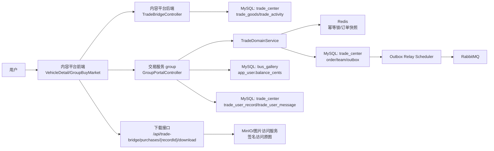
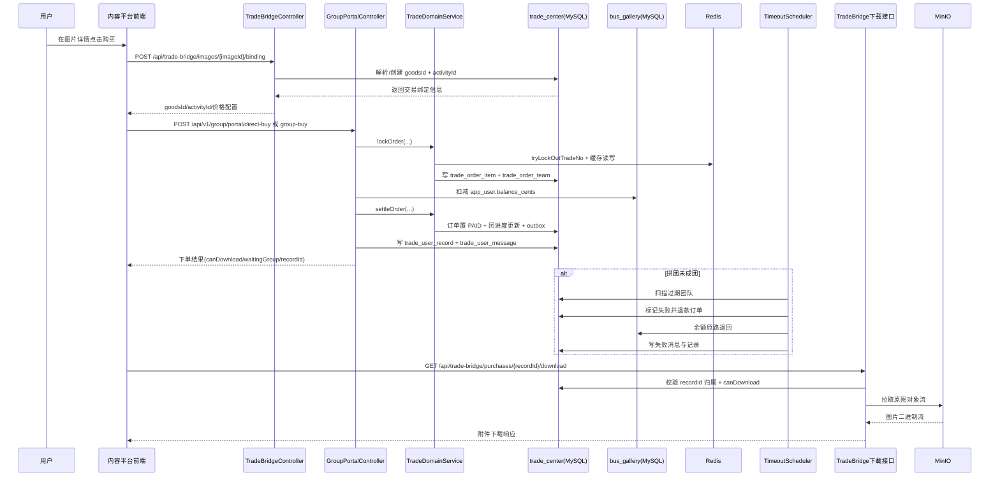

# Bus Gallery

Bus Gallery 是一个围绕公交车辆资料管理和内容协作建设的全栈系统。项目不是单纯的“图片展示站”，而是把车辆建档、图片上传、内容审核、评论互动、收藏行为、快照缓存和后台治理连成了一条完整链路，目标是在真实的互联网高并发场景下，既保证用户体验，也保证数据一致性和系统可维护性。

在当前版本中，系统已经形成了比较清晰的产品闭环：普通用户可以上传车辆信息并进入审核流；审核员与站长可以按权限完成审核与治理；前台用户可以稳定地进行浏览、评论、收藏；热点数据通过 Redis 和快照机制支撑高频读；副作用任务通过 RabbitMQ 异步化，避免把通知、推荐、热度统计等“慢动作”压在主请求上。整个链路强调“主流程可用优先，副作用尽力而为”，这是系统在并发压力下保持稳定的关键策略。

## 架构与技术选型

后端基于 Spring Boot 3.2.5，核心持久化由 MySQL 提供，Redis 承担会话、分页缓存、快照缓存与部分统计信号，MinIO 作为对象存储承载三层图片对象（原始对象、受控高清图、缩略图），RabbitMQ 负责评论与收藏事件的异步分发，前端使用 Vue 3 + Element Plus。Nginx 位于最外层，负责静态资源分发、API 反向代理和分层限流。

这个技术组合的优势在于职责边界清晰：MySQL 负责最终一致的数据落地，Redis 负责“快”和“抗压”，RabbitMQ 负责“解耦”和“削峰”，MinIO 负责“大对象存储”。因此当某个子系统短时波动（例如 Redis 写入异常）时，系统可以通过降级策略优先保障核心交易链路不崩溃。

## 当前版本的业务主线

车辆上传已经从“单次大表单直传”演进为“分片上传 + 合并提交 + 审核入库”的主路径。前端会先初始化分片会话，再逐片上传文件并展示实时进度，最后提交车辆元数据完成审核申请。后端 `ChunkUploadService` 在 Redis 正常时会记录会话元数据，在 Redis 出现 `MISCONF` 等写失败场景时会自动降级到本地会话存储，并通过临时熔断（短时间静默 Redis 写）减少连锁报错；`IdempotencyService` 也支持 Redis 锁不可用时回退本地锁，保障“重复提交防重”能力不丢失。

图片访问默认走签名访问链路。系统不会直接暴露 MinIO 公共下载链接，而是通过 `ImageAccessService` 生成带过期时间和 HMAC 签名的临时访问地址，再由 `GET /api/images/access/{token}` 回源读取对象流。这意味着即使用户拿到了历史 URL，也会因为过期而失效，从而把“对象可见性”控制在后端策略中。当前图片展示策略已经明确分层：非详情/非审核页面默认只使用 `thumbnailUrl`，车辆详情与审核页面使用带水印压缩后的受控高清 `url`，避免前端直接消费原始对象。

车辆浏览链路采用“列表缓存 + 详情快照”双层策略。列表页使用参数化缓存键和版本号机制，减少筛选和翻页时的数据库压力；详情快照按车牌聚合多变体车辆信息、评论、收藏摘要和推荐结果，减少前端瀑布请求。首页热门排序已经切换为访问量（view count）驱动，`POST /api/vehicles/{id}/view` 在写入端做防抖去重，避免短时刷新刷爆计数。

评论与收藏链路已经具备“同步主链路 + 异步副作用”的完整形态。评论发布和收藏切换先在事务内落 MySQL 并更新 Redis 缓存，再由 `BusEventPublisher` 在事务提交后投递 `comment.created` 与 `favorite.toggled` 事件。消费者侧执行通知、敏感词复审、榜单聚合、推荐打分、快照预热等副作用，采用 best-effort 策略：副作用失败只记录日志，不反向拖垮主业务。

审核与后台治理方面，系统支持普通用户提交创建/修改申请，审核员按省级权限域处理待审数据，站长拥有全局治理能力。后台模块不仅覆盖用户角色管理、地区/公司/品牌/车型字典维护，还增加了评论管理和可疑图片巡检清理能力，适合长期运营。

## 内容平台下单流程（自然语言 + 图）

在内容平台里，一次下单不是“前端直接调用支付”这么简单，而是先完成“图片到商品”的桥接，再进入交易域。具体来说，用户在图片详情点击购买后，前端会先调用 `POST /api/trade-bridge/images/{imageId}/binding`。这个桥接接口会检查该图片是否已有交易商品，如果没有就自动在 `trade_center` 里补齐 `goodsId` 和可用 `activityId`，并把价格、成团人数、有效时长等关键信息返回给前端。前端拿到这些 ID 后，才会请求 `POST /api/v1/group/index/config` 拉取交易配置，并展示下单页。

当用户真正点击支付时（当前版本仅支持余额支付），前端按场景调用 `POST /api/v1/group/portal/direct-buy` 或 `POST /api/v1/group/portal/group-buy`。交易服务会先做锁单幂等（避免弱网重复点击造成重复订单），再落订单和团队数据，随后扣减用户余额，并推进订单状态。如果是直接购买，支付成功后记录会立刻标记可下载；如果是拼团购买，系统会根据团队人数决定“立即成功”还是“等待成团”。等待中的订单由定时任务持续检查，超时未成团会自动退款并写入消息通知。

最终，用户可以在“消息”和“交易记录”看到结果。成功记录会携带 `recordId`，用户访问 `GET /api/trade-bridge/purchases/{recordId}/download` 时，后端会二次校验“是否本人 + 是否可下载”，通过后才回源读取原图并返回下载流。这个设计的核心是：内容平台负责体验入口，交易域负责状态一致性，下载接口负责最终权限闸门。

### 组件间数据流动图



### 下单时序图



## 稳定性与高并发设计思路

系统在“能跑”之外，已经开始具备“抗压可恢复”能力。首先，所有关键写路径都尽量以数据库事务结果为准，缓存和事件属于可重建的派生状态；其次，Redis 相关能力都增加了降级防线，例如分片上传会话与幂等锁的本地回退，避免基础设施抖动直接演化为业务不可用；再次，RabbitMQ 把高延迟副作用剥离出用户请求线程，主链路响应时间更加可控。

认证上下文也做了轻量化重构：`AuthTokenInterceptor` 从 Redis 会话读取后，不再把完整会话对象直接放进线程上下文，而是转换为 `AuthPrincipal`（仅保留 userId、role、reviewRegionId、token 等鉴权必需字段）写入 `AuthContextHolder(ThreadLocal<AuthPrincipal>)`。这样可以降低鉴权层与会话存储格式的耦合，也减少敏感字段在业务链路中的传播范围。

在性能层面，当前最值得关注的热点主要有三类：热点车辆评论页导致的高频分页读取、热门车辆收藏切换导致的聚合键高写入竞争、以及移动网络下的大图上传重试。项目已经用版本键缓存、事务后异步、分片上传与进度回传覆盖了第一轮优化，后续可以继续推进消息消费幂等、热点分桶、批量聚合和快照预热策略。

## 部署与运行

项目默认提供 Docker Compose 一键部署，包含 MySQL、Redis、MinIO、RabbitMQ、后端与前端服务。你可以在 `docker/` 目录直接启动整套环境：

```bash
cd docker
docker compose up -d
```

服务启动后，前端默认在 `http://localhost/`，后端 API 在 `http://localhost:8080/api`，MySQL 映射到 `localhost:13306`，MinIO 控制台在 `http://localhost:9001`，RabbitMQ 管理台在 `http://localhost:15672`。如果需要本地开发模式，可以分别在 `backend/` 运行 Spring Boot，在 `frontend/` 运行 Vite。

## 文档导航

根目录历史分散文档已统一归并到 `README.md` 和 `ABOUT.md`。建议按以下顺序阅读：
- 快速上手、运行与部署：本文件 `README.md`
- 架构、流程、接口、交易链路与中间件模型：`ABOUT.md`
- 根目录文档归并索引：`ABOUT.md` 中“附录 E：根目录文档归并映射（2026-04-03）”
- 根目录文档归并后的主题摘要：`ABOUT.md` 中“附录 G：根目录文档精细归并摘要（2026-04-03）”

如果你升级了图片展示策略（例如把详情图切换为受控高清图）后发现老数据仍然沿用旧链路，可启用历史回填任务 `ImageDisplayBackfillRunner`。该任务由 `busgallery.image-display-backfill.*` 配置控制，支持先按 `limit` 小批量试跑，再全量补齐 `_display.jpg`，最终把历史记录统一到“列表缩略图、详情高清图、签名访问”的模型。

## 目录结构

代码仓库维持前后端分层与部署分层。`backend/` 是 Spring Boot 业务核心，`frontend/` 是 Vue 前端，`docker/` 提供容器化部署，`docs/` 提供补充文档与规则说明。这样的结构适合持续迭代，也方便把后续服务拆分成独立微服务或独立前端站点。

