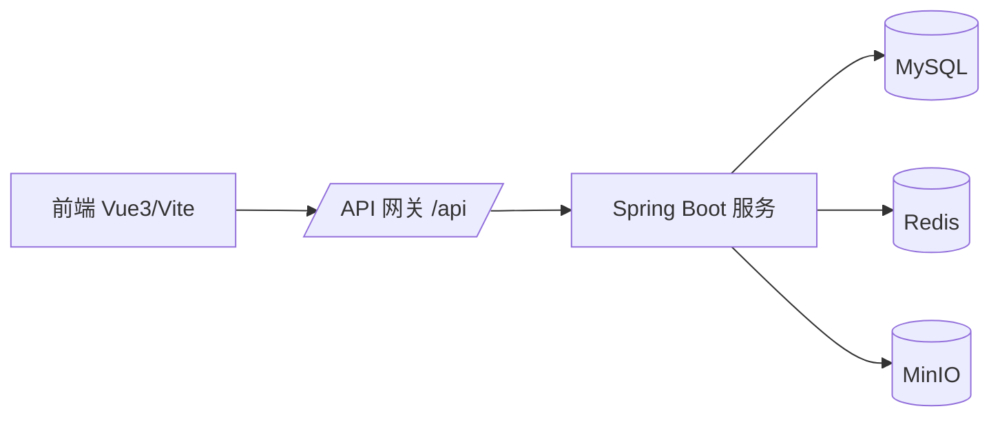

# Bus Gallery

Bus Gallery 是面向公交车辆资料的全栈系统，覆盖车辆档案、图片管理、评论与收藏、车辆快照（Redis big key）与缩略图生成，支持按地区 / 公司 / 品牌 / 车型多维筛选与变体合并展示。

---

## 功能总览

- 车辆图库：筛选、分页、按车牌合并变体
- 车辆详情：图片轮播、配置展示、评论、收藏
- 上传与存储：图片 + 车辆信息一次性上传，自动生成缩略图
- 快照：Redis big key 保存“车牌级详情快照”
- 缓存：列表请求 Redis 缓存 + 版本号一致性
- 部署：Docker Compose 一键启动

---

## 架构概览



---

## 关键设计点（面试高频）

1. 车辆详情快照（big key）
- 车牌维度快照：`/api/snapshots/plate/{plate}`
- Redis key：`bg:snapshot:plate:{plate}:latest` + `...:v{version}`
- 快照内容：变体、图片元数据、评论、收藏摘要、推荐
- 优势：详情页一次请求完成渲染，减少多接口拼装与瀑布请求

2. 列表缓存 + 一致性
- `/api/vehicles` 缓存进 Redis（TTL 60s）
- key 由筛选参数 + 游标 + `bg:vehicle:page:version` 组合
- 车辆增删改触发版本号自增 → 旧缓存自然失效

3. 上传幂等与缩略图
- 上传支持 `Idempotency-Key`
- 上传时自动生成缩略图并回写 `thumbnail_url`
- 历史图片可通过 `rebuild.thumbnails=true` 重建

4. 收藏/评论的高频交互优化
- 收藏按钮做去抖与最终态同步，避免“多次点击”造成 DB 压力
- 评论/收藏均受 `@RequireLogin` 保护

5. 分页策略
- 车辆列表采用游标分页（`lastLaunch` + `lastId`），避免偏移分页在大量数据下的性能退化

---

## 面试追问点（可直接回答）

- 一致性：列表缓存依赖版本号失效，快照缓存依赖 TTL + 最新版本指针
- 性能：缩略图优先、详情快照合并请求、收藏去抖、游标分页
- 事务边界：上传接口事务覆盖车辆/配置/图片关系写入
- 幂等：`Idempotency-Key` 防重提交，避免重复入库
- 安全：`@RequireLogin` + Redis Session，Authorization Bearer 校验
- 可扩展：快照机制可扩展为热门预热、写路径异步刷新

---

## 快速启动（Docker）

```bash
cd docker
docker compose up -d
```

服务地址：

- 前端：`http://localhost/`
- 后端 API：`http://localhost:8080/api`
- MySQL：`localhost:13306`（root / 123456）
- MinIO 控制台：`http://localhost:9001`（admin / 12345678）

---

## 本地开发

后端：

```bash
cd backend
./mvnw spring-boot:run -Dspring-boot.run.profiles=dev
```

前端：

```bash
cd frontend
npm install
npm run dev
```

---

## 文档入口

- 业务流程：`BUSINESS_FLOWS.md`
- 上传流程：`UPLOAD_MODULE_FLOWS.md`
- 接口文档：`API_DOCS.md`
- Swagger 静态文档：`docs/swagger/`

---

## 目录结构（摘要）

```
bus-gallery/
├─ backend/     # Spring Boot 后端
├─ frontend/    # Vue 3 前端
├─ docker/      # Docker Compose 与部署文件
├─ docs/swagger/ # Swagger 静态文档输出
├─ BUSINESS_FLOWS.md
├─ UPLOAD_MODULE_FLOWS.md
├─ API_DOCS.md
```
