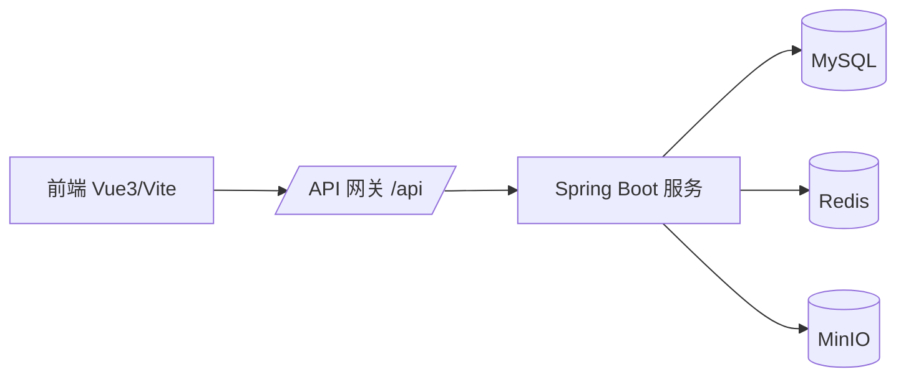

# Bus Gallery

Bus Gallery 是面向公交车辆资料的全栈系统，覆盖车辆档案、图片管理、评论与收藏、车辆快照（Redis big key）与缩略图生成，支持按地区 / 公司 / 品牌 / 车型多维筛选与变体合并展示。

---

## 功能总览

- 车辆图库：筛选、分页、按车牌合并变体
- 车辆详情：图片轮播、配置展示、评论、收藏
- 评论删除：评论作者可删本人评论，站长可在后台删除任意评论
- 详情布局：移动端评论在详情下方，电脑端评论默认显示在详情右侧
- 上传与存储：图片 + 车辆信息一次性上传，自动生成缩略图
- 快照：Redis big key 保存“车牌级详情快照”
- 缓存：列表请求 Redis 缓存 + 版本号一致性
- 异步副作用：评论发布、收藏切换通过 RabbitMQ 异步处理通知/推荐/热度等副作用
- 部署：Docker Compose 一键启动

---

## 组件级细节（互动链路）

前端组件与职责：
- `frontend/src/views/VehicleDetail.vue`：独立详情页。电脑端评论区固定在右侧，移动端评论在下方；支持发布/删除评论、收藏切换。
- `frontend/src/components/Gallery/VehicleDetailModal.vue`：图库弹窗详情。与详情页保持同一交互语义（桌面右侧评论、移动端下方评论）。
- `frontend/src/views/UserProfile.vue`：收藏夹入口。点击收藏卡片会强制刷新详情，避免旧缓存造成“已收藏但显示未收藏”。
- `frontend/src/views/AdminDashboard.vue`：站长后台评论管理区块，支持分页查看和删除评论。

后端组件与职责：
- `CommentController` + `VehicleCommentServiceImpl`：评论增删查、权限校验、评论缓存版本推进。
- `FavoriteServiceImpl`：收藏切换与摘要聚合，写后覆盖收藏缓存键。
- `AdminController`：站长评论分页与删除接口。
- `CommentCreatedEventConsumer` / `FavoriteToggledEventConsumer`：消费 RabbitMQ 事件并执行副作用（best-effort）。

组件内触发点（更细）：
- 评论发布：`submitComment -> store.addVehicleComment -> POST /api/vehicles/{vehicleId}/comments`。
- 评论删除：`canDeleteComment -> DELETE /api/vehicles/{vehicleId}/comments/{commentId}`，后端再做二次权限校验。
- 收藏切换：`toggleLike/toggleFavoriteAction -> POST /api/favorites/{vehicleId}/toggle`，随后主动拉 `summary` 做最终态校准。
- 后台删评：`AdminDashboard.handleDeleteComment -> DELETE /api/admin/comments/{commentId}`，内部复用评论服务删除逻辑。

同步/异步边界（关键）：
1. 评论/收藏主链路先落 MySQL，再写 Redis（版本键或覆盖写），这一段是同步返回路径。
2. 事件发布通过 `BusEventPublisher` 在事务 `afterCommit` 后执行，避免数据库回滚但消息已发。
3. RabbitMQ 消费侧对副作用使用 best-effort，失败仅记录日志，不反抛阻塞主业务。

高并发风险与当前缓解：
- 热门车辆评论高并发读：`bg:comments:ver` + 分页缓存键隔离，旧缓存自然过期。
- 收藏连点写放大：前端去抖 + 请求中保护，后端 toggle 原子化。
- 浏览量刷量风险：`bg:vehicle:view:dedupe:{vehicleId}:{fingerprintMd5}` 20s 去重。
- Redis 短时不可写：服务层大量 catch 降级，主链路以 MySQL 结果为准。

---

## 架构概览



---

## 关键设计点（面试高频）

1. 车辆详情快照（big key）
- 车牌维度快照：`/api/snapshots/plate/{plate}`
- Redis key：`bg:snapshot:plate:{plate}:latest` + `...:v{version}`
- 快照内容：变体、图片元数据、评论、收藏摘要、推荐
- 优势：详情页一次请求完成渲染，减少多接口拼装与瀑布请求

2. 列表缓存 + 一致性
- `/api/vehicles` 缓存进 Redis（TTL 60s）
- key 由筛选参数 + 游标 + `bg:vehicle:page:version` 组合
- 车辆增删改触发版本号自增 → 旧缓存自然失效

3. 上传幂等与缩略图
- 上传支持 `Idempotency-Key`
- 上传时自动生成缩略图并回写 `thumbnail_url`
- 历史图片可通过 `rebuild.thumbnails=true` 重建

4. 收藏/评论的高频交互优化
- 收藏按钮做去抖与最终态同步，避免“多次点击”造成 DB 压力
- 评论/收藏均受 `@RequireLogin` 保护

5. 分页策略
- 车辆列表采用游标分页（`lastLaunch` + `lastId`），避免偏移分页在大量数据下的性能退化

6. MQ 副作用降级（高可用）
- 评论发布后发 `comment.created` 事件；收藏切换后发 `favorite.toggled` 事件
- 副作用消费者采用 best-effort（通知、敏感词、推荐、榜单等失败只告警，不阻塞主业务）
- 即使 Redis 短时写失败（如 `MISCONF stop-writes-on-bgsave-error`），主链路仍以 MySQL 事务结果为准

7. 站长后台评论管理
- 后台新增评论管理区块，支持评论分页查看与删除
- 删除入口与前台共用评论删除服务，统一权限与缓存版本失效逻辑

---

## 面试追问点（可直接回答）

- 一致性：列表缓存依赖版本号失效，快照缓存依赖 TTL + 最新版本指针
- 性能：缩略图优先、详情快照合并请求、收藏去抖、游标分页、评论区按需轮询
- 事务边界：上传接口事务覆盖车辆/配置/图片关系写入
- 幂等：`Idempotency-Key` 防重提交，避免重复入库
- 安全：`@RequireLogin` + Redis Session，Authorization Bearer 校验
- 可扩展：快照机制可扩展为热门预热、写路径异步刷新、副作用消费者拆分独立服务

---

## 最近迭代（2026-03-25）

- 评论模块新增 `DELETE /api/vehicles/{vehicleId}/comments/{commentId}`，并补充作者/站长权限控制。
- 详情页与详情弹窗统一评论体验：电脑端右侧常显评论，删除无效评论按钮入口。
- 收藏状态一致性修复：从收藏夹打开详情时强制刷新详情与收藏摘要，避免旧缓存误显“未收藏”。
- 站长后台新增评论管理：`GET /api/admin/comments`、`DELETE /api/admin/comments/{commentId}`。
- RabbitMQ 消费容错增强：消费者记录错误但不反抛，避免重试耗尽影响可用性。

---

## 快速启动（Docker）

```bash
cd docker
docker compose up -d
```

服务地址：

- 前端：`http://localhost/`
- 后端 API：`http://localhost:8080/api`
- MySQL：`localhost:13306`（root / 123456）
- MinIO 控制台：`http://localhost:9001`（admin / 12345678）

---

## 本地开发

后端：

```bash
cd backend
./mvnw spring-boot:run -Dspring-boot.run.profiles=dev
```

前端：

```bash
cd frontend
npm install
npm run dev
```

---

## 文档入口

- 业务流程：`BUSINESS_FLOWS.md`
- 上传流程：`UPLOAD_MODULE_FLOWS.md`
- 接口文档：`API_DOCS.md`
- About 对照文档：`ABOUT.md`
- Swagger 静态文档：`docs/swagger/`

---

## 目录结构（摘要）

```
bus-gallery/
├─ backend/     # Spring Boot 后端
├─ frontend/    # Vue 3 前端
├─ docker/      # Docker Compose 与部署文件
├─ docs/swagger/ # Swagger 静态文档输出
├─ BUSINESS_FLOWS.md
├─ UPLOAD_MODULE_FLOWS.md
├─ API_DOCS.md
```
