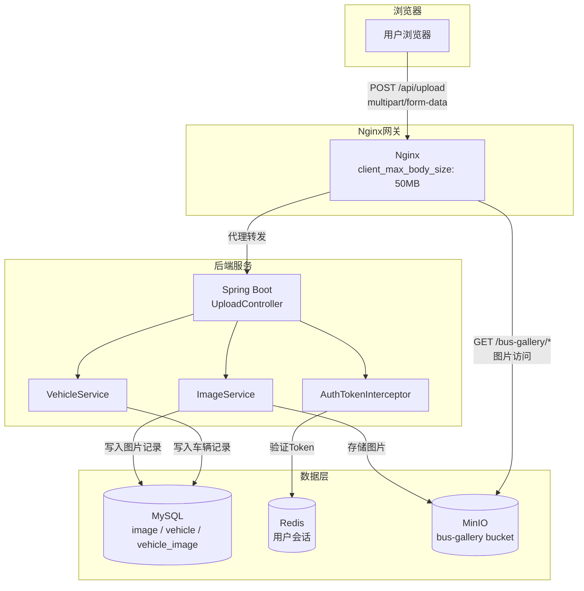
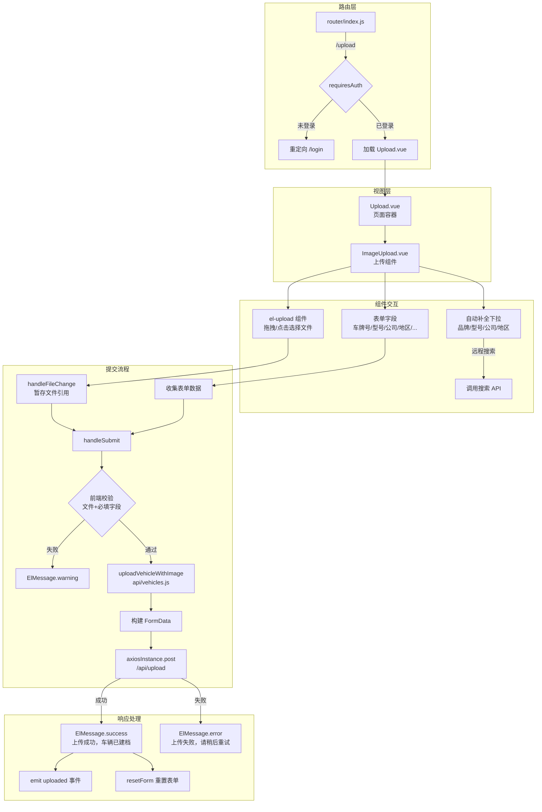
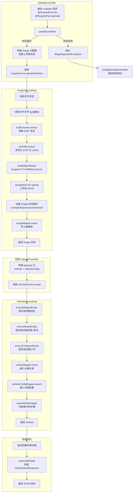
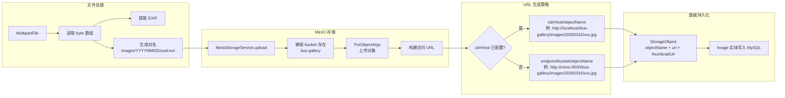
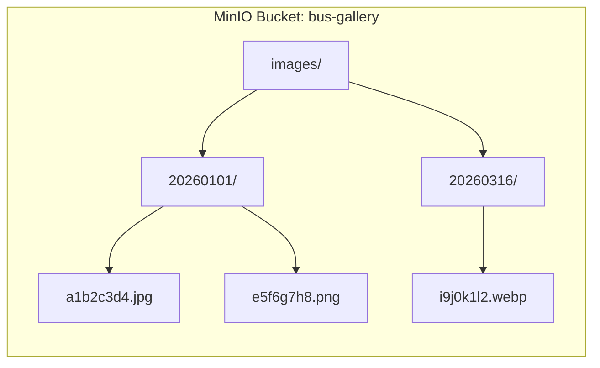
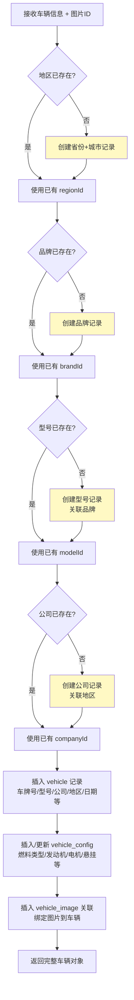
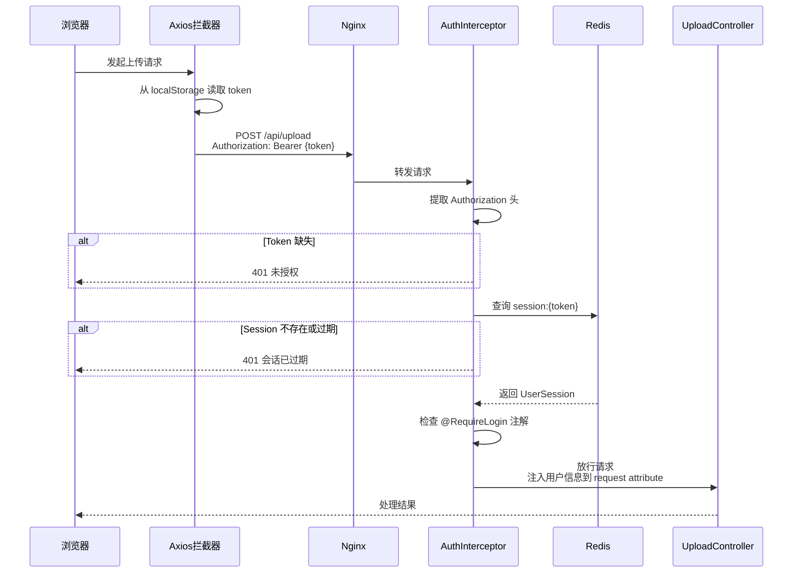
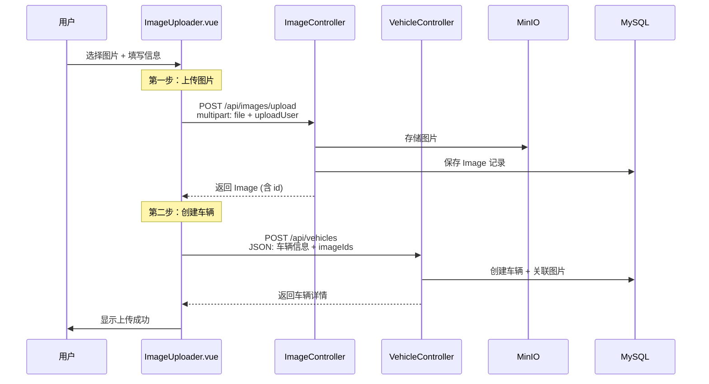

# 文件上传模块 — 流程图与业务流程

## 目录

- [1. 模块概览](#1-模块概览)
- [2. 系统架构图](#2-系统架构图)
- [3. 主上传流程（当前活跃路径）](#3-主上传流程当前活跃路径)
- [4. 前端交互流程](#4-前端交互流程)
- [5. 后端处理流程](#5-后端处理流程)
- [6. 图片存储流程](#6-图片存储流程)
- [7. 车辆建档流程](#7-车辆建档流程)
- [8. 认证鉴权流程](#8-认证鉴权流程)
- [9. 数据校验流程](#9-数据校验流程)
- [10. 异常处理流程](#10-异常处理流程)
- [11. 旧版两步上传流程（Legacy）](#11-旧版两步上传流程legacy)
- [12. 关键文件索引](#12-关键文件索引)
- [13. 配置参数一览](#13-配置参数一览)

---

## 1. 模块概览

文件上传模块是"公交车辆图库"系统的核心功能，允许已认证用户上传公交车辆照片并同时填写车辆档案信息。系统采用**单次 multipart 请求**将图片文件与车辆元数据一并提交，后端完成图片存储（MinIO）、EXIF 提取、车辆建档（MySQL）等一系列操作。

```
技术栈：
├── 前端：Vue 3 + Element Plus + Axios
├── 后端：Spring Boot 3.2.5 + MyBatis + JPA
├── 存储：MinIO（对象存储）
├── 缓存：Redis（会话管理）
├── 数据库：MySQL 8
└── 网关：Nginx（反向代理）
```

---

## 2. 系统架构图



---

## 3. 主上传流程（当前活跃路径）

完整的端到端上传流程，从用户操作到数据持久化：

```mermaid
flowchart TD
    Start([用户进入上传页面]) --> AuthCheck{已登录?}
    AuthCheck -->|否| Redirect[重定向到登录页]
    AuthCheck -->|是| ShowForm[展示上传表单]

    ShowForm --> SelectFile[选择/拖拽图片文件]
    SelectFile --> FillForm[填写车辆信息<br/>车牌号、型号、公司、地区等]
    FillForm --> ClickSubmit[点击提交]

    ClickSubmit --> FrontValidate{前端校验}
    FrontValidate -->|失败| ShowError1[显示错误提示]
    ShowError1 --> FillForm

    FrontValidate -->|通过| BuildFormData[构建 FormData<br/>file + payload JSON Blob]
    BuildFormData --> InjectToken[Axios 注入 Bearer Token]
    InjectToken --> SendRequest[POST /api/upload<br/>multipart/form-data]

    SendRequest --> NginxProxy[Nginx 代理转发]
    NginxProxy --> AuthIntercept{认证拦截器<br/>Token 有效?}
    AuthIntercept -->|无效| Return401[返回 401 未授权]
    Return401 --> ShowError2[前端显示错误]

    AuthIntercept -->|有效| BackValidate{后端参数校验}
    BackValidate -->|失败| ReturnError[返回错误信息]
    ReturnError --> ShowError2

    BackValidate -->|通过| UploadImage[上传图片到 MinIO]
    UploadImage --> ExtractExif[提取 EXIF 元数据]
    ExtractExif --> SaveImage[保存图片记录到 MySQL]
    SaveImage --> CreateVehicle[创建车辆档案<br/>自动创建品牌/型号/公司/地区]
    CreateVehicle --> LinkImage[关联图片与车辆<br/>vehicle_image 表]
    LinkImage --> ReturnDetail[返回车辆详情 JSON]

    ReturnDetail --> ShowSuccess[显示"上传成功，车辆已建档"]
    ShowSuccess --> ResetForm[重置表单]
    ShowSuccess --> EmitEvent[触发 uploaded 事件]

    UploadImage -->|失败| ThrowEx[抛出异常<br/>图片上传失败]
    ThrowEx --> GlobalHandler[全局异常处理器]
    GlobalHandler --> ShowError2

    style Start fill:#e1f5fe
    style ShowSuccess fill:#c8e6c9
    style Return401 fill:#ffcdd2
    style ReturnError fill:#ffcdd2
    style ThrowEx fill:#ffcdd2
```

---

## 4. 前端交互流程



---

## 5. 后端处理流程



---

## 6. 图片存储流程





---

## 7. 车辆建档流程



---

## 8. 认证鉴权流程



---

## 9. 数据校验流程

```mermaid
flowchart TD
    subgraph 前端校验 — ImageUpload.vue
        FA{已登录?} -->|否| FA1[提示请先登录]
        FA -->|是| FB{文件已选择?}
        FB -->|否| FB1[提示请选择图片]
        FB -->|是| FC{车牌号非空?}
        FC -->|否| FC1[提示请填写车牌号]
        FC -->|是| FD{型号已填?}
        FD -->|否| FD1[提示请选择型号]
        FD -->|是| FE{公司已填?}
        FE -->|否| FE1[提示请选择公司]
        FE -->|是| FF{地区已填?}
        FF -->|否| FF1[提示请选择地区]
        FF -->|是| FG[校验通过 ✓<br/>发送请求]
    end

    subgraph Nginx 层
        FG --> NA{请求体 ≤ 50MB?}
        NA -->|否| NA1[413 Request Entity Too Large]
        NA -->|是| NB[转发到后端]
    end

    subgraph Spring Boot 层
        NB --> SA{文件 ≤ 10MB?}
        SA -->|否| SA1[MaxUploadSizeExceededException]
        SA -->|是| SB[进入 Controller]
    end

    subgraph UploadController.validate
        SB --> BA{plateNumber 非空?}
        BA -->|否| BA1[IllegalArgumentException]
        BA -->|是| BB{modelId 或 modelName?}
        BB -->|否| BB1[IllegalArgumentException]
        BB -->|是| BC{companyId 或 companyName?}
        BC -->|否| BC1[IllegalArgumentException]
        BC -->|是| BD{regionId 或 regionCity?}
        BD -->|否| BD1[IllegalArgumentException]
        BD -->|是| BE[校验通过 ✓<br/>进入业务逻辑]
    end

    subgraph ImageServiceImpl
        BE --> CA{文件非 null 且非空?}
        CA -->|否| CA1[RuntimeException]
        CA -->|是| CB[校验通过 ✓<br/>开始处理]
    end
```

---

## 10. 异常处理流程

```mermaid
flowchart TD
    subgraph 异常来源
        E1[文件校验失败<br/>ImageServiceImpl]
        E2[参数校验失败<br/>UploadController]
        E3[MinIO 上传失败<br/>MinioStorageService]
        E4[数据库操作失败<br/>MyBatis]
        E5[认证失败<br/>AuthInterceptor]
        E6[文件过大<br/>Spring Multipart]
    end

    subgraph 异常类型
        E1 --> T1[RuntimeException<br/>上传文件至 MinIO 失败]
        E2 --> T2[IllegalArgumentException]
        E3 --> T1
        E4 --> T3[DataAccessException]
        E5 --> T4[BizException<br/>UNAUTHORIZED]
        E6 --> T5[MaxUploadSizeExceededException]
    end

    subgraph GlobalExceptionHandler
        T1 --> G1[handleException<br/>返回 code + message]
        T2 --> G1
        T3 --> G1
        T4 --> G2[handleBizException<br/>返回业务错误码]
        T5 --> G1
    end

    subgraph 事务回滚
        E3 -.->|@Transactional| R1[ImageServiceImpl<br/>DB 记录回滚]
        E4 -.->|@Transactional| R2[VehicleServiceImpl<br/>DB 记录回滚]
    end

    subgraph 前端处理
        G1 --> F1[Axios 拦截器<br/>提取 error.message]
        G2 --> F1
        F1 --> F2[ElMessage.error<br/>显示错误信息]
    end

    subgraph ⚠️ 已知问题
        R1 -.-> W1[MinIO 对象已上传<br/>但 DB 回滚后成为孤儿文件]
    end

    style W1 fill:#fff3e0,stroke:#ff9800
```

---

## 11. 旧版两步上传流程（Legacy）

系统中保留了两个旧版上传组件，采用两步分离式上传：



| 版本 | 文件 | 状态 |
|------|------|------|
| v1 (最早) | `components/ImageUploader.txt` | 已归档，使用 el-autocomplete + el-upload |
| v2 | `components/ImageUploader.vue` | 保留，自定义下拉组件 |
| v3 (当前) | `components/Upload/ImageUpload.vue` | **活跃使用**，单请求上传 |

---

## 12. 关键文件索引

### 前端

| 文件 | 职责 |
|------|------|
| `frontend/src/views/Upload.vue` | 上传页面路由视图 |
| `frontend/src/components/Upload/ImageUpload.vue` | 主上传组件（表单 + 拖拽上传） |
| `frontend/src/api/vehicles.js` | `uploadVehicleWithImage()` — 构建 FormData 并发送 |
| `frontend/src/api/images.js` | `uploadImage()` — 旧版图片上传 API |
| `frontend/src/api/axiosInstance.js` | Axios 实例，Token 注入 + 响应拦截 |
| `frontend/src/router/index.js` | 路由定义，`/upload` 需要认证 |

### 后端

| 文件 | 职责 |
|------|------|
| `controller/UploadController.java` | `POST /api/upload` — 主上传入口 |
| `controller/ImageController.java` | `POST /api/images/upload` — 旧版图片上传 |
| `controller/VehicleController.java` | `POST /api/vehicles` — 旧版车辆创建 |
| `service/impl/ImageServiceImpl.java` | 图片处理核心：EXIF 提取 + MinIO 上传 + DB 持久化 |
| `service/impl/VehicleServiceImpl.java` | 车辆建档：自动创建关联实体 + 事务管理 |
| `service/storage/MinioStorageService.java` | MinIO 对象存储操作 |
| `service/storage/StorageProperties.java` | MinIO 配置属性 |
| `entity/Image.java` | 图片实体 |
| `util/ExifExtractor.java` | EXIF 元数据提取 |
| `util/ExifUtils.java` | EXIF JSON 序列化 |
| `auth/AuthTokenInterceptor.java` | 认证拦截器 |
| `exception/GlobalExceptionHandler.java` | 全局异常处理 |

### 基础设施

| 文件 | 职责 |
|------|------|
| `docker/docker-compose.yml` | 服务编排（MySQL + MinIO + Redis + 应用） |
| `docker/nginx/default.conf` | Nginx 反向代理 + 静态资源 + 上传限制 |
| `backend/src/main/resources/application.yml` | Spring Boot 配置（上传限制 + MinIO + DB） |

---

## 13. 配置参数一览

| 参数 | 值 | 位置 | 说明 |
|------|-----|------|------|
| 前端文件大小提示 | 20 MB | `ImageUpload.vue` | ⚠️ 仅 UI 提示，未强制校验 |
| Spring 最大文件大小 | 10 MB | `application.yml` | 实际生效的后端限制 |
| Spring 最大请求大小 | 10 MB | `application.yml` | 含文件+表单的总请求限制 |
| Nginx 最大请求体 | 50 MB | `nginx/default.conf` | 网关层限制 |
| 允许文件类型 | JPG, PNG, WebP | `ImageUpload.vue` | ⚠️ 仅 UI 提示，后端未校验 |
| 单次上传文件数 | 1 | `ImageUpload.vue` | el-upload `:limit="1"` |
| MinIO Bucket | `bus-gallery` | `application.yml` | 对象存储桶名 |
| 图片路径模式 | `images/YYYYMMDD/<uuid>.<ext>` | `ImageServiceImpl` | 按日期分区存储 |
| 会话有效期 | 86400s (24h) | `application.yml` | Redis 会话 TTL |

> ⚠️ **已知不一致**：前端提示最大 20MB，但后端 Spring 限制为 10MB，可能导致用户上传 10-20MB 文件时收到意外错误。建议统一为相同值。
