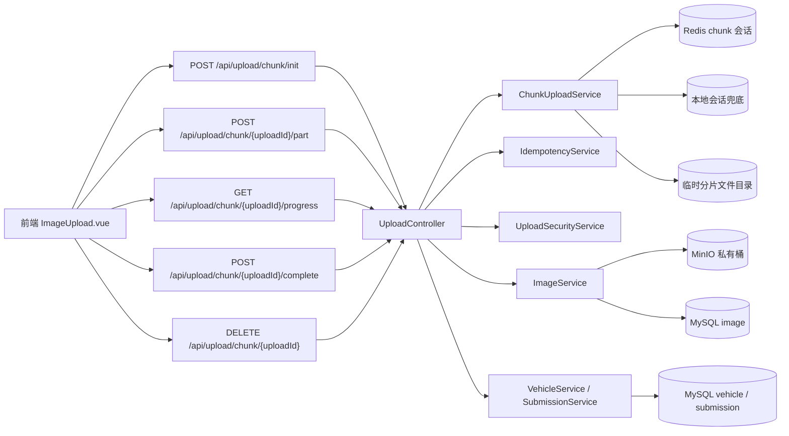
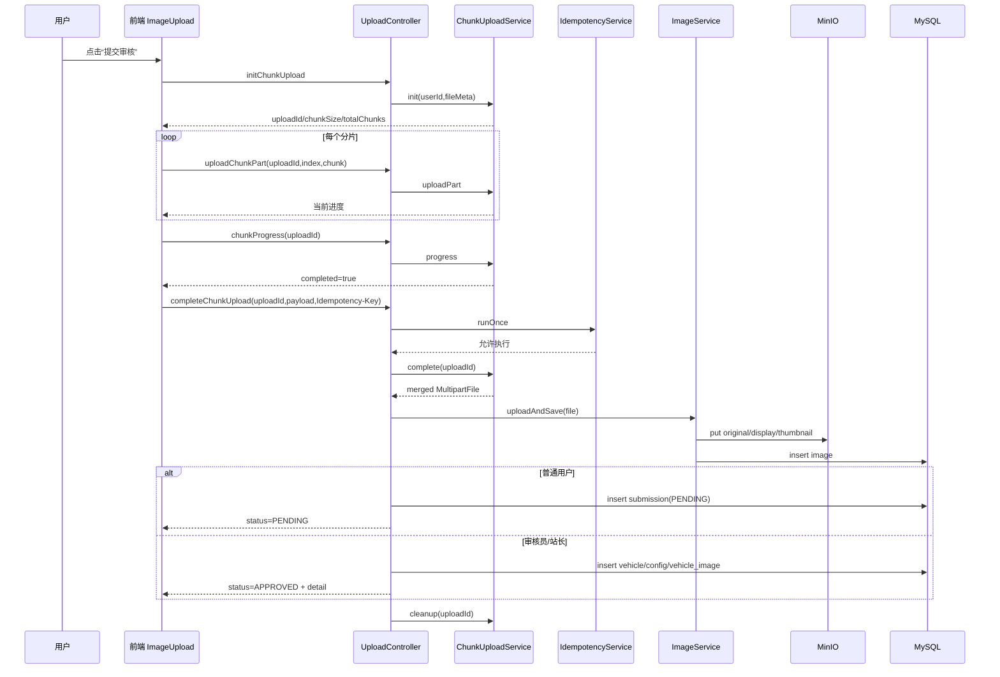

# 上传模块流程（最新代码版）

## 模块定位与边界

上传模块承担的是“把一张图片和一份车辆业务数据，安全、可追踪地送进系统”的职责。它既不是纯文件上传，也不是单纯表单提交，而是把前端分片上传、后端会话管理、对象存储写入、审核入库与幂等防重串成了一个完整业务流程。对普通用户来说，这条链路的业务结果是“提交审核”；对审核员和站长来说，这条链路的业务结果是“直接建档成功”。

在当前版本里，上传链路的核心入口在 `UploadController`，分为单次上传与分片上传两套接口。前端实际主用的是分片上传，单次上传仍保留作为兼容路径。分片链路对应 `ChunkUploadService`，它负责上传会话管理、分片落盘、进度统计、合并文件与清理。真正的图片落地在 `ImageService.uploadAndSave`（写 MinIO + 写图片表），车辆业务落地在 `VehicleService.create` 或审核提交流程 `SubmissionService.submitCreate`。

## 接口与组件协作全景

这张图里最关键的设计点是：分片阶段主要处理“文件可靠传输”，完成阶段才进入“业务落地”；同时 Redis 不是唯一生命线，上传会话在 Redis 出错时会回退本地存储，避免分片流程一刀切失败。

## 前端到后端的真实执行路径

用户点击“提交审核”后，前端会先校验登录态、文件大小、车牌号、车型、公司、地区等必填字段。校验通过后，前端先调用 `POST /api/upload/chunk/init` 初始化会话，服务端返回 `uploadId`、`chunkSize` 和 `totalChunks`。随后前端按索引逐片调用 `POST /api/upload/chunk/{uploadId}/part?index=n`，每成功一片都会更新进度条。全部分片上传完后，前端再调用 `GET /api/upload/chunk/{uploadId}/progress` 做一次服务端确认，确认完成后才发 `POST /api/upload/chunk/{uploadId}/complete` 触发最终业务提交。

`complete` 阶段是链路中最关键的一步。后端先用 `IdempotencyService.runOnce` 做幂等防重，再让 `ChunkUploadService.complete` 合并临时分片文件，之后进入 `handleUpload`。`handleUpload` 会调用 `ImageService.uploadAndSave` 生成并写入三类对象（原始对象、缩略图、受控高清图）并写入 `image` 表，然后根据当前用户角色分流：普通用户生成 `submission`（状态 `PENDING`），审核员/站长直接调用 `VehicleService.create` 建档并返回详情。最后无论成功或失败，都会执行 `chunkUploadService.cleanup` 清理会话和临时文件。

## 分片上传时序图

## Redis、临时文件与降级逻辑

上传模块会把分片会话写进 Redis 哈希键（前缀 `busgallery:upload:chunk:`），并设置 TTL。理论上 Redis 可以承载跨实例的会话共享，但系统并没有把可用性完全绑死在 Redis 上。`ChunkUploadService` 在每次初始化和心跳时都会同步维护一份本地 `localSessionStore`。如果 Redis 读写抛出 `MISCONF` 或其他异常，服务会继续用本地会话处理，保证当前上传任务不立即失败。

为了避免 Redis 在异常窗口内持续刷屏报错，代码里有一个“临时静默写入”机制：检测到 `MISCONF` 后，会短时间（60 秒）跳过 Redis 写入并记录告警。这个策略的意义是“快速止血”，防止一个基础设施异常放大为成百上千次重试日志和线程浪费。需要注意的是，这个机制提升的是可用性，不是强一致性；如果你部署多实例并依赖跨实例续传，应优先修复 Redis 持久化问题。

## 幂等、限流与安全控制

幂等控制由 `IdempotencyService` 提供。`completeChunkUpload` 会优先使用请求头 `Idempotency-Key`，没有就回退到 `chunk-complete:{uploadId}`。正常情况下用 Redis `setIfAbsent` 加锁，Redis 不可用时回退本地锁，避免用户重复点击导致重复建档。对于运行时异常，幂等锁会在当前实现中主动释放，允许用户修正后重试。

限流和配额由 `UploadSecurityService` 负责，在 `init` 和单次上传入口都会执行。Nginx 层也有 `/api/upload` 专属限流区与更高的上传超时配置。两层限流叠加后，系统可以分别防御“边缘层洪峰流量”和“应用层业务滥用”。

## MinIO 交互时机与访问策略

上传链路与 MinIO 的交互只发生在最终提交阶段，不会在每个分片都写对象存储。这样可以避免“大量小对象写入 + 合并失败残留”的成本。真正写对象在 `ImageService.uploadAndSave` 内部完成，随后才写图片元数据到 MySQL。当前元数据语义是：`objectName` 指向原始对象，`thumbnailUrl` 指向缩略图对象，`url` 指向受控高清图对象。

对象读取采用私有桶 + 临时签名访问，不暴露长期公开 URL。列表和详情中展示的图片链接本质上是 `ImageAccessService` 生成的短期 token URL（`/api/images/access/{token}`），后端验证签名和过期时间后再回源 MinIO 读取流。前端分发策略是：普通浏览场景只用 `thumbnailUrl`，详情页和审核页用 `url`（受控高清图）。这个模型把下载权限控制权收回到了应用层，便于后续叠加水印、反爬和审计策略。

## 同步与异步边界

上传模块主链路是严格同步提交：分片上传成功并不等于业务成功，只有 `complete` 完成并落库后才算最终成功。当前上传链路本身不直接依赖 RabbitMQ；它的异步部分主要体现在审核后的其他模块副作用（例如评论、收藏）里。上传阶段为了可预期，采取的是“同步确认 + 明确状态返回”，并通过 `PENDING/APPROVED` 状态把业务结果显式反馈给前端。

## 可能的性能瓶颈与优化方向

上传高峰时，最容易出现压力的点通常是三处。第一处是临时文件目录的磁盘 I/O，尤其在并发分片写入与合并同时发生时，需要关注宿主机磁盘吞吐与文件系统 inode。第二处是 `complete` 阶段的大文件内聚操作，这一步会把分片顺序复制到合并文件，CPU 与磁盘都会有短时峰值。第三处是 MinIO 与 MySQL 的串行写路径，如果对象写成功而数据库写失败，会出现“对象存在但业务未提交”的治理成本。

当前版本已经通过“分片原子落盘、异常即清理、Redis 降级、本地会话兜底、幂等防重”解决了第一阶段稳定性问题。并且增加了历史图片回填任务 `ImageDisplayBackfillRunner`，用于把旧数据补齐受控高清图对象并修正 `url` 字段，避免详情页误回退到缩略图链路。后续如果要进一步支撑更高并发，可以考虑把分片目录切换到独立高速盘、引入异步病毒扫描与图片处理队列、在上传完成后增加对象生命周期治理任务，以及把会话状态改造为更强的分布式状态机。

## 关键配置与排障入口

上传相关参数集中在 `application.yml` 的 `busgallery.upload-security` 与 `spring.servlet.multipart`。其中 `max-file-bytes`、`chunk-size-bytes`、`chunk-max-parts` 直接决定上传策略上限；`chunk-temp-dir` 决定分片文件落地位置；`chunk-session-ttl-seconds` 决定断点续传窗口。线上排障时，优先关注 Nginx 上传限流日志、应用层 `ChunkUploadService` 告警、Redis `MISCONF` 状态与宿主机磁盘剩余空间。

如果你需要继续扩展这个模块，建议遵循一个原则：把“用户感知成功”的条件收敛到少数可验证步骤，把“可补偿副作用”移出主链路。这样可以在并发场景下保持稳定，也能把错误恢复路径做得更清晰。
