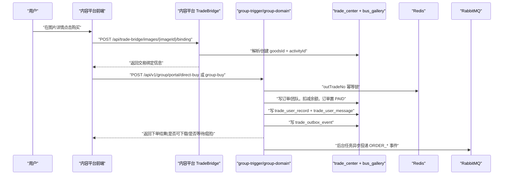
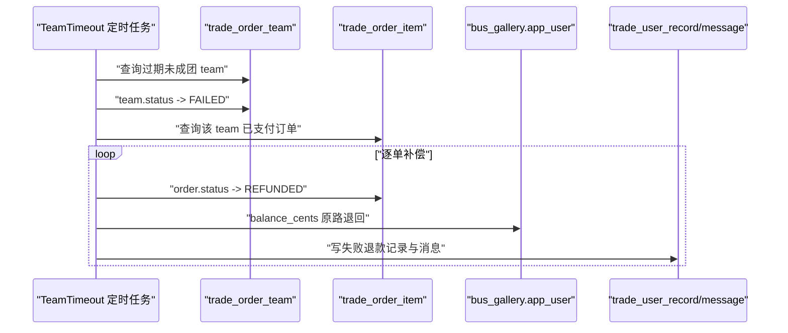

# 好图拼团交易后端（六层架构）

这个 `group` 目录是一套可独立部署的拼团交易后端，目标不是只做“能下单”，而是把真实业务里最容易出问题的链路一起补上，包括锁单幂等、支付后状态推进、成团判定、超时退款、消息通知、交易记录沉淀，以及和内容平台的图片商品桥接。当前代码统一使用包名 `com.busgallery.groupbuy`，并通过六层模块把“接口契约、入口适配、领域规则、基础设施、公共类型、启动装配”拆开，减少耦合。

## 六层模块如何协作

系统按以下模块协作：

1. `group-api`：定义交易契约（DTO 与服务接口）
2. `group-trigger`：HTTP 入口、鉴权、参数校验、异常标准化
3. `group-domain`：核心业务规则（锁单/结算/退款）
4. `group-infrastructure`：MySQL + Redis + RabbitMQ 适配
5. `group-types`：统一错误码、响应体、异常与 ID 生成
6. `group-app`：Spring Boot 启动与运行配置

每个模块都有单独 README，可直接查看实现细节：

1. `group/group-api/README.md`
2. `group/group-trigger/README.md`
3. `group/group-domain/README.md`
4. `group/group-infrastructure/README.md`
5. `group/group-types/README.md`
6. `group/group-app/README.md`

## 如何对接内容平台

这套交易后端并不是孤立存在，而是通过内容平台的桥接接口接入图片发布系统。内容侧在图片详情页拿到 `imageId` 后，会先调用主平台接口 `POST /api/trade-bridge/images/{imageId}/binding`。这一步会在 `trade_center` 中解析或创建 `goodsId` 与 `activityId`，并返回给前端。前端再拿这两个关键 ID 去请求 `group` 服务的 `/api/v1/group/index/config`、`/api/v1/group/portal/direct-buy`、`/api/v1/group/portal/group-buy` 等接口。这样交易域和内容域可以解耦演进：内容平台不需要感知拼团内部表结构，拼团服务也不需要侵入内容模块代码。

支付完成后，交易记录会写入 `trade_user_record`，消息会写入 `trade_user_message`。如果记录状态允许下载，内容平台通过 `GET /api/trade-bridge/purchases/{recordId}/download` 做权限校验后放行原图下载，确保“只对已支付且可下载记录开放原图”。

## 实际业务流程（下单、锁单、拼团、扣款、回滚）

### 1）下单与锁单

无论是直接购买还是拼团购买，都会先进入锁单流程。`TradeDomainService.lockOrder` 先用 Redis 锁 `outTradeNo`，避免同一个外部单号并发重入；再校验商品和活动是否可售、是否匹配；然后查询是否已有同 `outTradeNo` 订单（缓存 + 数据库），有则直接返回旧结果，没有才新建订单并占用团名额。这样可以防止弱网重复点击造成重复占坑。

### 2）扣款与支付确认

在门户编排层 `TradePortalService`，锁单成功后会从 `bus_gallery.app_user.balance_cents` 扣减余额，再调用 `settleOrder` 把订单推进到 `PAID`。这个流程在事务中执行，若扣款或后续状态写入失败，会整体回滚，避免出现“钱扣了但订单没支付成功”。

### 3）拼团成团与等待

拼团模式下，支付成功并不代表立刻可下载。系统会看团队是否达到 `target_count`。达到目标则团队转为 `SUCCESS`，并把相关记录更新为可下载；未达到目标则保持等待态，用户可在消息中心看到“拼团进行中”。

### 4）超时退款与事务补偿

定时任务会扫描过期且未成功的团队（`trade_order_team.status=0 且 valid_end_time < NOW()`）。命中后会把团队置为失败，再批量把已支付订单改为退款态，并把金额原路加回用户余额，同时写入“拼团失败已退款”消息。这样在“先支付、后等待成团”的业务模型下，超时失败也有明确资金闭环。

### 5）事务回滚边界

领域命令（锁单、结算、退款）均在事务内执行，订单表与团队表状态一起提交；门户层扣款 + 领域结算也在同事务边界中协同。只要中途抛错，数据库更新会回滚到操作前状态。对于跨中间件场景（数据库 + MQ），系统采用 Outbox 模式避免“数据库成功、消息丢失”。

## 消息异步与一致性

领域层不会直接向 RabbitMQ 发消息，而是先把事件写入 `trade_outbox_event`（同事务）。后台任务 `RabbitOutboxRelayScheduler` 定时拉取待发布事件，发送到 `group.trade.exchange`，按事件类型路由到不同队列。发送失败会累加重试计数并延迟重试，直到成功或进入失败重试状态。这个机制保证了交易主链路不被 MQ 抖动拖垮，同时又能把事件可靠地异步扩散给后续消费者。

## 实战细节与边界条件

真实业务里最常见的问题不是“接口写不出来”，而是“重复请求、并发冲突、半成功状态”怎么收敛。当前实现已经覆盖了几类关键场景。第一类是弱网重试和重复点击：同 `outTradeNo` 会先经过 Redis 短锁，再经过订单表唯一键约束，命中后直接回放已有订单结果。第二类是并发抢同一团：团队 `lock_count` 达到 `target_count` 后会拒绝继续锁单，避免超卖式占坑。第三类是活动失效：市场仓储会优先找时间窗内活动，找不到时会尝试修复最新活动或创建默认活动，避免前端拿到“永远不可用”的死活动。

还有一些资金与一致性细节也需要注意。当前门户层扣款是直接执行余额字段递减，事务上能保证“扣款和订单状态同进退”，但余额是否允许被扣到负值需要你在后续版本补充账户校验策略。超时退款链路已经具备“团队失败 -> 订单退款 -> 余额返还 -> 用户消息”的闭环，但如果未来接入第三方支付网关，还需要把外部退款回调与内部退款状态做双向幂等。Outbox 已经解决了“DB 成功但 MQ 暂时失败”的问题，不过消费端也要落实去重，才能完成全链路幂等。

## 端到端时序图（内容平台到交易成功）


## 超时失败退款时序图


## 启动与构建

在 `group` 目录单独编译：

```bash
cd group
mvn -DskipTests compile
```

单独启动交易服务：

```bash
cd group/group-app
mvn spring-boot:run
```

默认端口是 `8092`。若走 Docker Compose 一体化部署，请确保 `trade_center` 库已初始化，且 MySQL、Redis、RabbitMQ 连接参数与 `group-app/src/main/resources/application.yml` 中环境变量一致。
