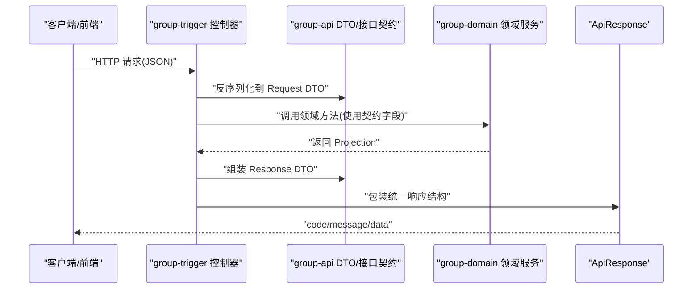

# group-api 模块说明

## 模块作用
`group-api` 是拼团交易服务的“协议层”，它不直接处理数据库，也不直接监听 HTTP 请求，而是把系统对外可见的请求和响应对象统一定义好。这样做的好处是，`group-trigger`、`group-domain` 和未来可能新增的 SDK 都能使用同一份契约，避免接口字段在多个模块里各自维护，导致联调时出现“字段名对不上、类型不一致”的问题。

在当前实现里，这个模块主要包含两类内容：一类是 `GroupMarketApi`、`GroupTradeApi` 这样的服务接口定义；另一类是请求/响应 DTO，比如 `PortalCheckoutRequest`、`LockOrderResponse`。业务代码真正执行时会由 `group-trigger` 实现这些接口并进行参数校验、结果封装。

## 对外 API 契约
`group-api` 定义了以下核心接口契约：

1. `GroupMarketApi#queryMarketConfig`
2. `GroupTradeApi#lockOrder`
3. `GroupTradeApi#settleOrder`
4. `GroupTradeApi#refundOrder`

同时它也定义了门户侧结算与查询 DTO，例如：

1. `PortalCheckoutRequest`：`goodsId`、`activityId`、可选 `teamId`、`source`、`channel`
2. `PortalCheckoutResponse`：`outTradeNo`、`orderId`、`teamId`、`teamStatus`、`canDownload` 等
3. `PortalTeamSummaryResponse`、`PortalUserMessageResponse`、`PortalUserRecordResponse`

这些对象全部围绕“金额按分存储（`xxxCents`）”和“订单状态可读文本”来设计，便于前端直接渲染交易态。

## 运行流程
当请求进入系统时，`group-trigger` 控制器先接收 HTTP 参数，再映射到 `group-api` 的 DTO。校验通过后，控制器把 DTO 转成领域调用参数，交给 `group-domain` 执行。领域结果返回后，再由控制器组装成 `group-api` 里的响应 DTO，最终统一封装成 `ApiResponse<T>` 返回给调用端。

因为契约层和执行层分离，后续如果你要把当前 REST 入口改为 RPC 或网关聚合接口，`group-api` 可以保持稳定，减少上层调用方改动范围。

## 时序图

