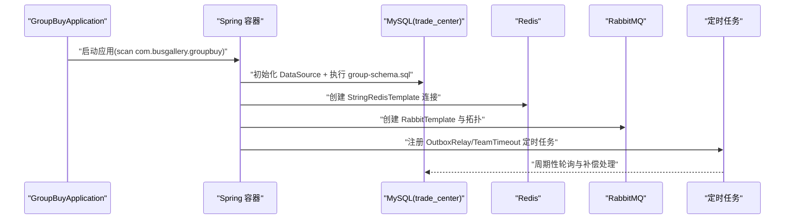

# group-app 模块说明

## 模块作用
`group-app` 是拼团交易服务的启动与装配模块，它负责把前面五层模块组装成一个可运行的 Spring Boot 应用。这个模块不承载具体业务规则，但它决定了服务怎么启动、连接哪些基础设施、定时任务是否开启、配置从哪里读取。

当前入口类是 `GroupBuyApplication`，已启用 `@EnableScheduling`，意味着 Outbox 投递任务和团超时检查任务会在服务启动后自动运行。

## 运行配置
`application.yml` 里定义了关键运行参数：

1. 服务端口：默认 `8092`
2. 数据源：默认连接 `trade_center` 库（可通过环境变量覆盖）
3. Redis：用于鉴权会话读取与交易幂等缓存
4. RabbitMQ：用于交易事件异步分发
5. `spring.sql.init.mode=always`：启动时自动执行 `group-schema.sql`，补齐 `trade_user_record` 与 `trade_user_message` 表
6. 定时参数：Outbox 轮询间隔、重试延迟、团超时扫描间隔

这意味着你在 Docker 或本地运行时，只要基础依赖可达，服务启动后会自动具备“交易记录+消息中心+异步事件投递”的最小运行能力。

## 运行流程
服务启动时，Spring 会扫描 `com.busgallery.groupbuy` 下所有组件，装配控制器、领域服务、基础设施适配器和拦截器。随后初始化数据源和缓存客户端，并执行 SQL 初始化脚本。应用对外提供 HTTP API 的同时，后台定时任务会持续执行：一条负责扫描 Outbox 并投递 RabbitMQ，另一条负责处理超时未成团团队并触发退款补偿。

## 时序图

