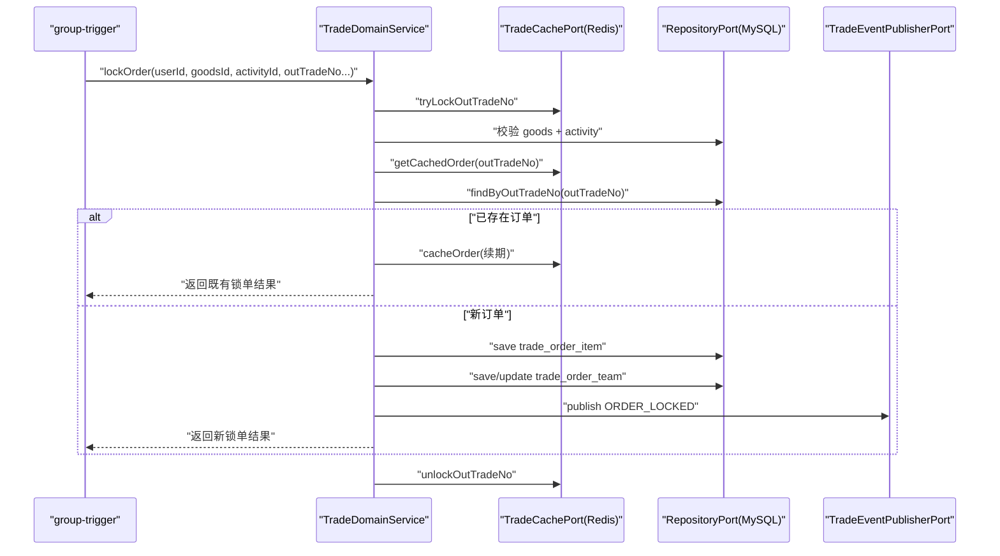

# group-domain 模块说明

## 模块作用
`group-domain` 是交易核心规则层，所有“是否允许下单、什么时候成团、什么时候退款、如何回滚计数”的判断都在这里完成。它不依赖具体数据库实现，而是依赖一组 Port 接口（仓储端口、缓存端口、事件发布端口），因此业务规则和技术实现被清晰拆开。

在当前代码中，最关键的两个领域服务是：

1. `MarketDomainService`：负责市场配置读取（商品状态、活动有效性、活跃团统计）
2. `TradeDomainService`：负责锁单、结算、退款三个交易主命令

## 领域 API（Java）
`TradeDomainService` 提供以下核心方法：

1. `lockOrder(...)`：锁定订单并占用团名额
2. `settleOrder(userId, outTradeNo, outTradeTime)`：把锁单状态推进到已支付
3. `refundOrder(userId, outTradeNo)`：订单退款，并修正团的锁单数/成单数

`MarketDomainService` 提供：

1. `queryMarketConfig(goodsId)`：返回活动配置与价格信息

## 运行流程
以 `lockOrder` 为例，领域层先尝试 Redis 幂等锁（按 `outTradeNo`），再校验商品与活动是否可用、是否匹配。之后会检查是否已有同 `outTradeNo` 订单（缓存和数据库双查），如果已有则直接返回旧结果，避免重复扣款或重复占坑。若没有旧订单，则根据模式（拼团/直购）创建或加入团队，写入 `trade_order_item`，并更新 `trade_order_team` 的 `lock_count`。最后写出 Outbox 事件 `ORDER_LOCKED`。

`settleOrder` 会把订单状态推进为 `PAID`，同步增加团队 `complete_count`，人数达到目标后把团状态改成 `SUCCESS`，并写出 `ORDER_SETTLED` 事件。`refundOrder` 会把订单改成 `REFUNDED`，并根据原状态回滚团队计数，如果原来已经成功成团且人数被退款后不足目标，还会把团队状态退回 `GROUPING`，再写出 `ORDER_REFUNDED` 事件。

所有方法都在事务中执行，确保订单状态、团队状态、事件记录在同一事务边界内保持一致。

## 时序图

