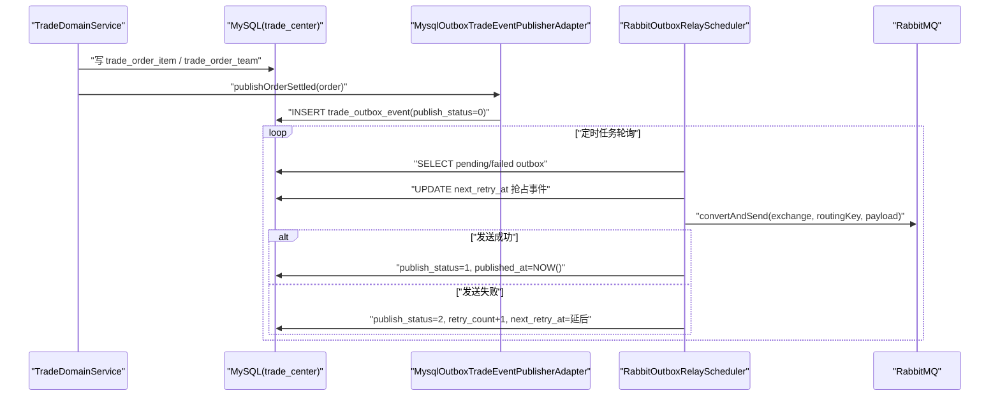

# group-infrastructure 模块说明

## 模块作用
`group-infrastructure` 是领域端口的技术实现层，负责把 `group-domain` 的抽象 Port 落到真实中间件上。在当前实现中，这一层同时连接 MySQL、Redis、RabbitMQ：MySQL 负责交易持久化，Redis 负责幂等锁和短期快照，RabbitMQ 负责异步事件分发。

它的核心价值是把“怎么存、怎么发消息、怎么缓存”从领域规则里剥离出去，让业务规则保持纯粹，可测试性更高。

## 关键实现与 API
主要适配器与职责如下：

1. `MysqlMarketRepositoryAdapter`：实现商品与活动查询，包含短 TTL Redis 缓存与活动自动修复/兜底创建
2. `MysqlTeamOrderRepositoryAdapter`：实现团单查询与保存（`trade_order_team`）
3. `MysqlUserOrderRepositoryAdapter`：实现用户订单查询与保存（`trade_order_item`）
4. `RedisTradeCacheAdapter`：实现 `outTradeNo` 幂等锁与订单快照缓存
5. `MysqlOutboxTradeEventPublisherAdapter`：同事务写 `trade_outbox_event`
6. `RabbitOutboxRelayScheduler`：定时扫描 Outbox，将事件投递到 RabbitMQ
7. `TradeRabbitTopologyConfig`：声明交换机、队列、路由键绑定

## 运行流程
业务命令执行时，领域层会调用这里的 MySQL 适配器写订单和团队，并通过 Redis 适配器做短期幂等保护。与此同时，Outbox 适配器把事件写入数据库，状态初始为待发布。后台调度器每隔一段时间轮询 `trade_outbox_event`，抢占可发布事件并投递到 RabbitMQ。投递成功就标记为已发布，失败则增加重试次数并延后下次重试，避免消息丢失。

这种“业务事务 + Outbox + 异步投递”的模式，能在不引入分布式事务的前提下，较好地保障最终一致性。

## 时序图

