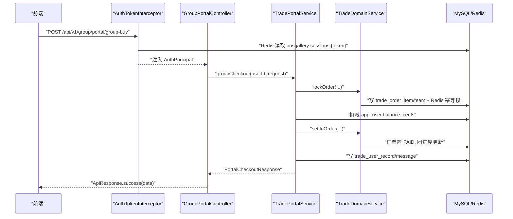

# group-trigger 模块说明

## 模块作用
`group-trigger` 是拼团交易服务的流量入口层，负责把外部 HTTP 请求转换成内部业务调用。它主要处理三件事：鉴权、参数校验、错误标准化。你可以把它理解为“交易模块的大门和前台”，所有对外接口都在这里暴露，然后再把业务动作分发给 `group-domain` 或 `TradePortalService`。

鉴权逻辑由 `AuthTokenInterceptor` 完成。它会从 `Authorization` 头或 `token` 参数中取出令牌，再去 Redis 读取主内容平台的会话数据（键前缀默认 `busgallery:sessions:`），解析成 `AuthPrincipal` 放进 `ThreadLocal`。标注了 `@RequireLogin` 的接口，如果当前请求没有登录态，会直接抛出未授权异常。

## 对外 HTTP API
当前模块提供的主要接口如下：

1. `POST /api/v1/group/index/config`：按 `goodsId` 查询可售配置（活动、价格、目标人数、活跃团数）
2. `POST /api/v1/group/trade/lock`：锁单，占坑位，生成订单骨架
3. `POST /api/v1/group/trade/settle`：支付成功后确认订单
4. `POST /api/v1/group/trade/refund`：退款并回滚团状态
5. `GET /api/v1/group/portal/teams`：查询某活动下的进行中团
6. `POST /api/v1/group/portal/direct-buy`：直接购买（支付成功后立刻可下载）
7. `POST /api/v1/group/portal/group-buy`：拼团购买（支付后等待成团）
8. `GET /api/v1/group/portal/messages`：我的消息
9. `GET /api/v1/group/portal/records`：我的交易记录

所有接口统一返回 `ApiResponse<T>`，并由 `GlobalApiExceptionHandler` 做异常收敛，避免前端面对不稳定错误结构。

## 运行流程
一次典型的“拼团购买”调用会这样走：请求到达控制器前，拦截器先尝试恢复登录用户；控制器读取请求体后校验参数，调用 `TradePortalService.groupCheckout`；服务内部再调用 `TradeDomainService.lockOrder` 与 `settleOrder`，并完成余额扣减、记录入库、消息入库。最后控制器把响应对象返回给前端。若任一环节抛出业务异常，异常处理器会统一转成标准错误码和可读提示。

这层不直接写复杂业务规则，重点是保证“入口行为可控、返回结构稳定、鉴权一致”。

## 时序图

