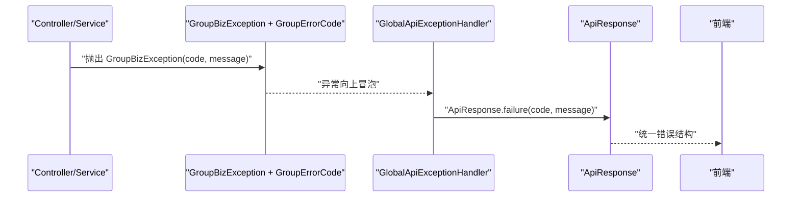

# group-types 模块说明

## 模块作用
`group-types` 是交易模块的公共类型层，放的是所有层都要用到、但不应该分散在业务代码中的“基础件”。典型包括统一响应结构、错误码枚举、业务异常类型和 ID 生成器。它让整个工程在错误语义、返回格式和主键风格上保持一致。

这个模块本身不处理业务流程，但它决定了“系统说话的语言”：调用方拿到什么格式的结果、失败时如何区分参数错与系统错、订单/团队/记录 ID 的生成规则是什么。

## 核心类型
主要类型包括：

1. `ApiResponse<T>`：统一接口返回结构（成功/失败都走同一壳）
2. `GroupErrorCode`：标准错误码枚举
3. `GroupBizException`：领域和应用层主动抛出的业务异常
4. `IdFactory`：订单、团队、消息、事件等业务 ID 生成

在 `group-trigger` 中，`GlobalApiExceptionHandler` 会把 `GroupBizException` 和校验异常统一映射为 `ApiResponse.failure(...)`，前端就能按稳定规则解析错误。

## 运行流程
一次失败请求通常是这样的：控制器或领域层发现参数不合法、资源不存在或并发冲突，抛出 `GroupBizException`；异常处理器捕获后根据 `GroupErrorCode` 组装标准错误响应。这样前端无论遇到哪类错误，都不会拿到不可预测的堆栈格式，而是统一的 `code/message/data`。

ID 生成器则在下单、建团、写消息、写事件时被调用，保证链路 ID 风格一致，便于排障时跨表追踪。

## 时序图

