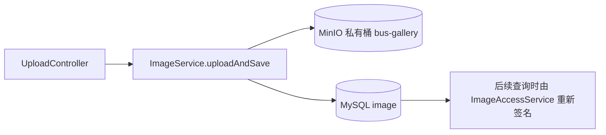
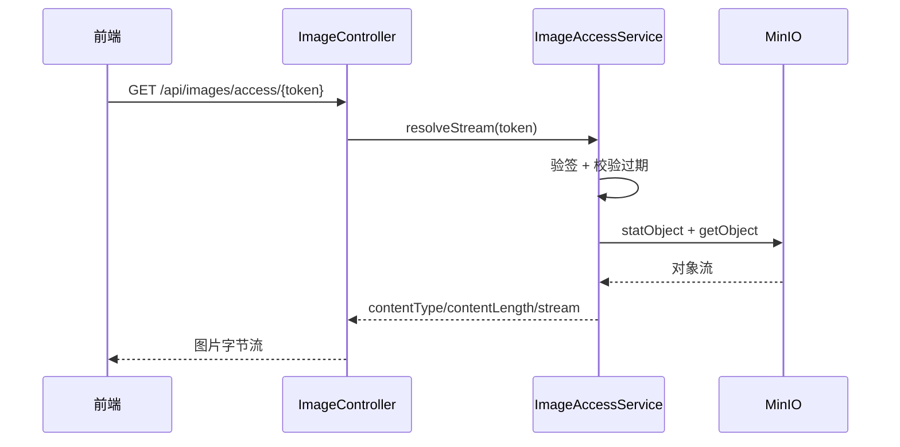

# 图片访问与 MinIO 安全流程

## 模块目标

图片模块不仅要“存得下”，还要“控得住”。系统当前采用的是私有桶 + 临时签名访问模型：图片对象存储在 MinIO 私有桶中，前端拿到的是短期有效 token URL，而不是永久公开地址。这样可以把访问控制、过期策略和风控能力留在后端。

核心组件包括 `ImageService`、`ImageAccessService`、`ImageController` 与 MinIO 客户端。上传阶段由 `ImageService.uploadAndSave` 写对象和元数据，读取阶段由 `GET /api/images/access/{token}` 验签后回源对象流。

## 上传写入流程

上传请求在通过业务校验后，会把三层对象写入 MinIO：原始对象、缩略图对象、受控高清图对象（压缩 + 强水印）。同时在 MySQL `image` 表记录 `objectName`、`url`、`thumbnailUrl`、尺寸与 EXIF 等元数据。字段语义是：`objectName` 对应原始对象，`url` 对应受控高清图，`thumbnailUrl` 对应缩略图。数据库保存的是可追踪对象标识，前端最终展示时会再经过签名刷新，不直接把长期对象地址暴露出去。

## 读取访问流程

当列表页或详情页需要展示图片时，后端会把对象引用交给 `ImageAccessService` 生成签名 URL。签名 payload 包含对象名和过期时间，签名算法使用 HMAC-SHA256。客户端访问 `/api/images/access/{token}` 时，服务端会校验 token 结构、签名和过期时间，校验通过后才去 MinIO 拉取对象流并回传。前端策略是：非详情/非审核页面默认只使用 `thumbnailUrl`；详情页和审核页使用 `url` 对应的受控高清图。

## 为什么这是“私有桶安全访问”

在当前 Nginx 配置中，前端并没有直接代理 `/bus-gallery/*` 到 MinIO 的公开通道。也就是说用户即使知道对象路径，也不能直接无鉴权下载。真正可访问的入口是后端签名接口，且 token 有时效和签名校验。因此这套方案属于“应用层受控访问”，不是“任何人拿 URL 永久可读”的公开桶模型。

## 与其他模块的耦合关系

车辆列表、车辆详情、快照接口都会在返回前刷新签名 URL，避免旧 token 过期导致图片空白。快照链路会优先保留详情可用的高清主图，不再回退为缩略图主图。后台可疑图片巡检也依赖 `ImageAccessService.objectExistsRef` 来判断对象是否存在，从而识别“数据库有记录但对象丢失”的脏数据。

## 性能与风险点

签名访问模型的核心收益是安全，但也带来额外开销：每次展示都要刷新 URL，真实读取也会经过后端转发。当前系统通过短缓存和轻量签名逻辑控制成本。为了处理历史数据，系统新增了 `ImageDisplayBackfillRunner`，可按批次为旧记录补齐 `_display.jpg` 并修正 `url` 字段，确保旧图也符合“列表缩略图、详情高清图”的新规则。后续如果图片流量继续增长，可以考虑引入受控 CDN（仍保留签名校验）或按场景区分不同对象 TTL，进一步平衡安全与性能。
