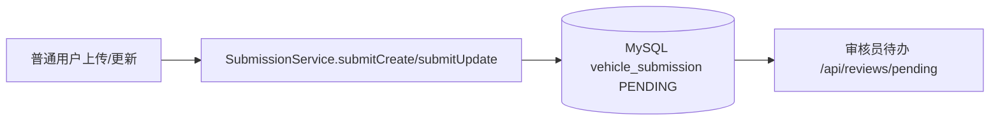
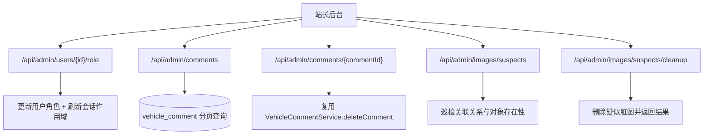

# 审核与后台治理流程

## 模块定位

审核与后台治理模块决定了系统内容质量和运营可控性。上传模块只是把数据送进来，真正决定“能不能上架、谁能改、如何清理异常数据”的是审核与治理流程。当前实现由 `ReviewController`、`SubmissionServiceImpl` 与 `AdminController` 组成，覆盖了提交审核、区域化审核、站长全局治理三层能力。

## 用户提交审核流程

普通用户通过上传或更新入口提交后，后端不会直接改动正式车辆数据，而是写入 `vehicle_submission`，状态为 `PENDING`。这一步会记录提交者信息、区域信息、目标车辆、附带图片和原始 payload。审核通过前，正式车辆表保持不变，这样可以确保线上展示数据始终经过审核。

## 审核员处理流程

审核员通过 `POST /api/reviews/{id}/approve` 或 `.../reject` 处理工单。`SubmissionServiceImpl` 会先做权限校验，核心规则是“审核员只能处理自己省级范围内的工单”，站长则不受此限制。通过时会根据工单动作类型（CREATE/UPDATE）调用 `VehicleService.create` 或 `VehicleService.update`，然后把工单状态改为 `APPROVED`；驳回时会写入驳回码和驳回原因并标记 `REJECTED`。审核页图片预览默认使用受控高清图链路（不是缩略图主图），以保证审核判读清晰度。

审核通过时真正修改的是正式车辆数据，因此这一步是审核链路中最关键的事务边界。任何区域权限判断、payload 校验都必须在落库前完成。

## 后台治理流程

后台治理入口集中在 `AdminController`。站长可以查看全站概览、管理用户角色、维护地区/公司/品牌/车型字典、分页管理评论、巡检可疑图片并批量清理。评论删除会复用评论服务层，确保版本键失效逻辑一致；用户角色变更后会调用 `UserSessionService.refreshRoleScopeByUserId` 刷新在线会话权限，避免“角色已经改了但旧 token 还在用旧权限”的窗口风险。

## 权限模型要点

系统权限模型可以概括为三层。普通用户负责内容提交与个人数据操作；审核员负责区域内工单与有限范围业务维护；站长拥有全局操作权限。审核和后台接口都依赖 `@RequireLogin` + 角色校验，任何跨区域或越权写操作都会被显式拒绝。

这种分层模型的价值是把“内容生产”和“内容上线”解耦，既保证社区活跃度，也保证数据质量和运营安全。

## 性能与可靠性关注点

审核模块在高峰期的瓶颈通常不是单次处理速度，而是工单堆积和区域分配不均。当前实现通过区域范围过滤和状态流转保证正确性，但后续可以补充工单优先级、自动分派与 SLA 监控。后台治理侧建议长期观察评论分页和图片巡检的查询性能，必要时对时间字段和关联字段补充索引。
