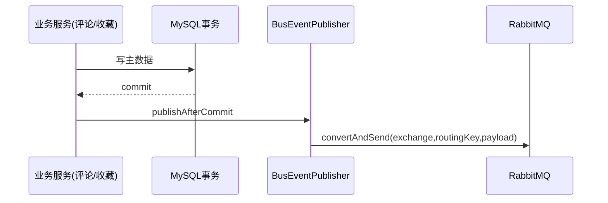
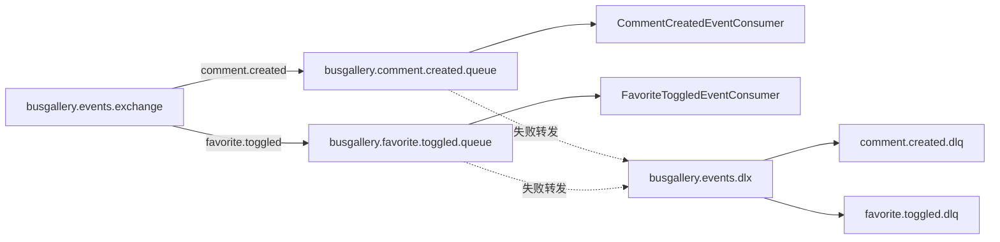

# 消息队列副作用流程

## 为什么要有这条流程

评论发布和收藏切换本质上是用户高频操作。如果把通知、推荐、热度榜单、敏感词复审、快照预热都放在同步请求里，接口时延会被副作用拖慢，失败面也会扩大。当前系统通过 RabbitMQ 把这些“非主结果动作”拆到异步链路，让主业务先返回，再在后台慢慢做副作用。

这条链路的核心组件是 `BusEventPublisher`、`RabbitEventConfig`、`CommentCreatedEventConsumer`、`FavoriteToggledEventConsumer` 以及对应 side-effect service。

## 事件生产与事务边界

事件生产端在评论服务和收藏服务中触发。设计上最重要的一点是：`BusEventPublisher` 默认使用 `afterCommit` 发布。也就是说，只有数据库事务真正提交成功后，事件才会发出去。这样可以避免“数据库回滚了但消息已经投递”的数据错位问题。

## RabbitMQ 拓扑

`RabbitEventConfig` 定义了业务交换机、两个主队列和对应死信队列。主队列分别消费 `comment.created` 与 `favorite.toggled`。消息持久化开启，监听器重试开启并限制最大次数，失败后按死信策略进入 DLQ，避免单条坏消息反复打爆消费者。

## 消费逻辑与 best-effort 策略

`CommentSideEffectService` 会依次执行通知、敏感词复审、热度统计、推荐信号、快照预热；`FavoriteSideEffectService` 会执行榜单聚合、推荐信号和通知。每个动作都封装在 `runBestEffort`，即单个动作失败不会打断整个消费函数。消费者本身也会捕获异常，只记录日志，不向上抛出业务异常。

这意味着系统把副作用定位为“可补偿的派生数据”。主链路正确性优先，副作用一致性通过重放、补偿或离线任务逐步收敛。

## Redis 交互时机

副作用服务里多数动作会写 Redis（例如 ZSet 热度榜、推荐信号键、敏感词标记键）。这些写入都发生在异步消费阶段，而不是用户同步请求路径。这样做的直接收益是：当 Redis 短时抖动时，用户的评论/收藏成功率不受直接影响。

需要注意的是，副作用失败虽然不会阻塞主流程，但会影响推荐和榜单的新鲜度。因此生产环境应重点监控消费者错误率和死信堆积。

## 并发场景下的风险与建议

在热点车辆场景下，`favorite.toggled` 可能短时密集写同一个热度键，`comment.created` 可能短时触发大量快照预热请求。当前 best-effort 策略保证了“不会拖垮主链路”，但并不保证“副作用实时强一致”。后续建议逐步引入消费幂等键、批量聚合更新与预热限流，以降低热点抖动。

如果未来业务规模继续扩大，可以把 side-effect service 拆成独立消费者组，让通知、推荐、热度、审核信号分别扩容，进一步提升吞吐与故障隔离能力。
