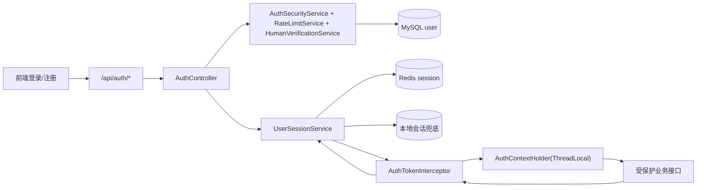

# 认证与会话流程

## 这条流程在系统里的作用

认证与会话流程决定了“谁可以访问什么接口”，也决定了系统在并发登录和 Redis 波动场景下是否还能稳定工作。当前实现由 `AuthController`、`AuthSecurityService`、`AuthTokenInterceptor`、`UserSessionService` 共同构成。登录、注册、验证码、人机校验、邮件挑战都从 `AuthController` 进入；登录成功后签发 token 并写入会话；所有后续受保护接口都由拦截器读取 token 并注入当前用户上下文。

这条链路有一个非常实用的设计：会话主存储在 Redis，但 `UserSessionService` 维护了本地会话兜底。也就是说，当 Redis 临时异常时，系统不会立刻“全员掉线”，而是允许一定窗口内继续读取本地会话，保障核心接口可用。

## 端到端调用图

## 登录成功后的会话写入过程

用户通过 `POST /api/auth/login` 提交用户名和密码时，后端会先执行验证码/限流/密码校验等安全动作。校验通过后，`UserSessionService.createSession` 生成随机 token，并写入 `busgallery:sessions:{token}`。会话 TTL 由 `auth.session.ttl-seconds` 控制，默认是 24 小时。

除了会话主键外，系统还会写一个反向索引集合 `busgallery:user:sessions:{userId}`，用于“按用户踢下线”或“角色变更后批量刷新会话”。这让后台角色管理模块可以在更新用户角色后，立即刷新在线会话的权限范围，而不需要等待用户重新登录。

## 请求鉴权过程

所有请求都会经过 `AuthTokenInterceptor`。拦截器优先从 `Authorization` 头读取 Bearer token，没有再尝试 `token` 查询参数。拿到 token 后调用 `UserSessionService.getSession`，如果取到会话，就把用户信息写入 `AuthContextHolder`。业务代码里 `@RequireLogin` 通过这个上下文判断当前请求是否已登录。

请求完成后，拦截器会在 `afterCompletion` 里清理 `AuthContextHolder`，避免线程复用导致用户上下文串数据。这一步对线程池模型非常关键。

## Redis 失败时的降级行为

`UserSessionService` 在 Redis 读写失败时，会自动回退到本地 `ConcurrentHashMap` 存储会话，并带过期时间。它还维护了本地用户 token 映射，保证“按用户清理会话”和“刷新显示名/角色范围”在降级模式下仍可用。

为避免日志风暴，服务对 Redis 回退告警做了节流（固定时间窗口内最多打一条警告）。这类设计让系统在 Redis 故障期间更像“性能降级”而不是“直接停机”。

## 安全与性能注意点

认证流程在应用层和网关层都有限流。应用层针对登录、发码、找回密码等细分场景设置了不同维度（IP、邮箱、账号）的配额；Nginx 侧又对 `/api/auth/` 做了独立限流区。双层限流能同时压制恶意请求和突发洪峰。

如果后续要继续增强，可考虑把本地会话兜底升级为可观测状态（例如健康探针暴露“当前是否处于 Redis fallback”），并在高安全场景下引入 token 旋转、设备指纹绑定与更严格的风险策略。
