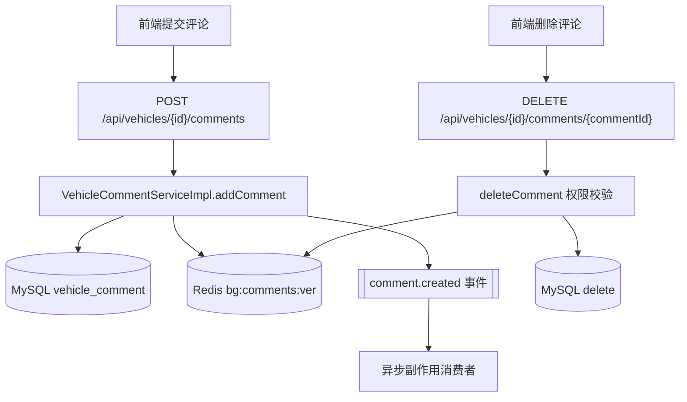
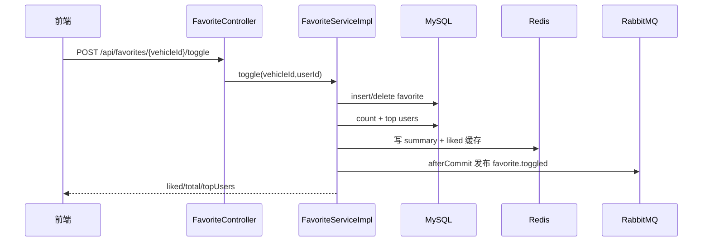

# 评论收藏与互动流程

## 模块定位

评论与收藏模块是系统最典型的高频互动链路。它一方面要保证主流程“点了就生效”，另一方面又要避免高并发下把通知、推荐、热度等副作用全压在同步请求里。当前实现采用“事务内落库 + 缓存即时更新 + 事务后发事件”的三段式设计，既保持用户侧即时反馈，也为后续扩展留出了异步处理空间。

评论入口在 `CommentController`，收藏入口在 `FavoriteController`，核心业务分别由 `VehicleCommentServiceImpl` 与 `FavoriteServiceImpl` 执行。两条链路都受 `@RequireLogin` 保护。

## 评论发布与删除

评论发布时，`addComment` 会先校验内容并确认车辆存在，然后在事务内写入 `vehicle_comment`。写成功后立即 `INCR bg:comments:ver:{vehicleId}`，让评论列表和计数缓存自动切换到新版本命名空间。事务提交后再发布 `comment.created` 事件，异步触发通知、敏感词复审、热度统计、推荐打分和快照预热。

评论删除同样在事务内执行，并复用同一版本键失效策略。权限规则非常明确：评论作者本人可以删除自己的评论，站长可以删除任意评论，其他用户删除会返回无权限错误。后台模块删除评论时也是走同一服务方法，因此权限与缓存行为一致。

## 收藏切换与摘要查询

收藏切换由 `toggle` 完成，事务内根据是否已收藏执行 insert 或 delete，并实时计算总收藏数和前排用户列表。结果会同步写入两个缓存键：`bg:fav:summary:{vehicleId}` 与 `bg:fav:liked:{vehicleId}:{userId}`。这样详情页在写后立刻刷新摘要时，能够直接命中最新态，避免“明明收藏了却显示未收藏”的错觉。

事务提交后会发布 `favorite.toggled` 事件，异步做榜单聚合、推荐信号更新和通知。因为这些是副作用，消费者采用 best-effort，失败只打日志，不反向影响主请求。

## 同步与异步边界

评论和收藏的“真结果”都在同步事务内完成，数据库是最终事实源；缓存用于加速读，失败可重建；事件用于副作用，失败可补偿。这个边界划分可以把最核心的用户体验稳定在可控范围内：用户只关心“是否评论成功/是否收藏成功”，而不会因为通知系统偶发抖动导致主流程失败。

## 可能的性能问题

当某台车成为热点对象时，评论和收藏会集中打到同一组 Redis key 与数据库记录。评论侧可能出现分页回源抖动，收藏侧可能出现聚合键写竞争。当前版本通过版本键缓存、短 TTL 和异步副作用缓冲了第一轮压力。后续可考虑增加热点车辆的分桶计数、评论分页上限保护，以及收藏行为的批量聚合写策略。
