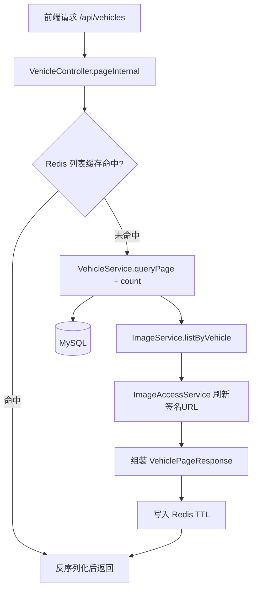
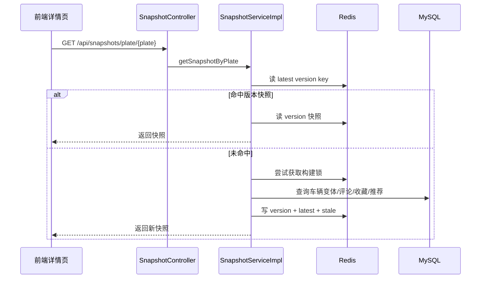

# 车辆浏览与快照流程

## 模块定位

车辆浏览模块负责把“多条件筛选 + 分页 + 详情展示 + 热门排序”做成稳定可扩展的查询链路。当前系统把浏览读链路拆成两层：列表接口侧重快速筛选和分页，快照接口侧重一次性返回详情聚合数据。这样既能保证首页和列表页响应速度，也能降低详情页多接口拼装带来的抖动。

这个模块的关键入口是 `VehicleController` 与 `SnapshotController`。前者负责 `/api/vehicles`、`/api/vehicles/{id}`、`/api/vehicles/{id}/view`；后者负责 `/api/snapshots/plate/{plateNumber}` 与 `/api/snapshots/hot`。缓存策略由 Redis 承担，热点聚合由 `SnapshotServiceImpl` 负责。

## 列表查询与缓存流程

列表缓存键包含筛选参数和游标参数，同时叠加 `bg:vehicle:page:version` 版本号。车辆数据发生增删改时，只需要 bump 版本号，不必逐个删缓存键。这个做法特别适合多维筛选场景，避免缓存失效逻辑复杂化。

## 访问量统计与热门排序

当前热门逻辑已从“综合热度”切换到“访问量 viewCount”。前端打开详情时会调用 `POST /api/vehicles/{id}/view`，后端在 `VehicleService.recordView` 执行去重后累计访问量，然后首页热门通过 `SnapshotService.listHotSnapshots` 调用 `vehicleService.listHotByViewCount` 获取排序结果。

从并发角度看，view 计数要重点防止刷量与写热点。系统已有短窗口去重策略，后续如果访问量继续上升，可以把写入改造成批量聚合或按时间片落库，进一步降低数据库写放大。

## 详情快照流程

快照内容不是只有车辆基础信息，而是包含同牌多变体、评论列表、收藏摘要和推荐结果。快照写入时会做 gzip + base64，降低 Redis 大 key 的网络和内存压力。服务还维护 `stale` 兜底快照，当重建锁被占用且有旧数据时，会先返回旧快照，避免热点牌照在重建瞬间出现空白页。当前快照图片刷新策略已明确：详情主图优先受控高清图，不再把缩略图作为主图返回。

## 图片 URL 刷新策略

无论是列表还是快照，返回前都会调用 `ImageAccessService` 刷新签名 URL。这样可以避免客户端长期缓存过期 token 导致图片 401。这个设计也把 MinIO 私有桶访问控制留在后端，前端只接触短期可用的访问地址。前端消费规则也已固定：列表与普通浏览页面使用 `thumbnailUrl`，详情页与审核页使用 `url`（受控高清图）。

## 性能风险与优化建议

浏览链路的主要压力点是“高频筛选 + 热点详情”。前者容易导致缓存键爆炸，后者容易导致单牌照快照重建竞争。当前版本通过版本键、构建锁、stale 兜底已经覆盖第一阶段风险。后续建议把热门快照做定时预热，并对高频筛选参数做白名单化，减少低价值缓存写入。
